# 1. 介绍

## 1.1 Anaconda

Anaconda是一个包含数据科学常用包的 Python 发行版本。它基于 conda ——一个包和环境管理器——衍生而来。你将使用 conda 创建环境，以便分隔使用不同 Python 版本和不同程序包的项目。你还将使用它在环境中安装、卸载和更新包。

## 1.2 conda

conda是一个环境管理器，Conda是在Windows、mac和Linux上运行的开源软件包管理系统和环境管理系统

Conda可以轻松地在本地计算机上的环境和版本中创建，保存，加载和切换

例如：在我们做大型项目中，需要3.5版本的python环境时，利用conda可以配置需要的环境，当需要3.8版本环境时，也可以直接用conda进行环境配置。方便我们在之后更方便


# 2. 终端

如图在pycharm中的Terminal也可以进行类似cmd的操作。

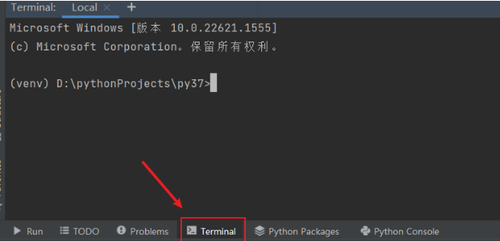

## 2.1 conda

查看python版本

```
python
python --version
```

测试conda是否正常

```cmd
conda
```

查看conda版本

```
conda -V
conda --version
```

进入base环境

```
activate
```

创建环境（创建3.8版本名为xxx的环境）

```
conda create -n xxx python=3.6

eg：conda create -n python2 python=python2.7 numpy pandas
#创建了python2环境，python版本为2.7，同时还安装了numpy pandas包
```

 选择环境（名为xxx的环境）

```
conda activate xxx
```

退出到base环境

```
conda deactivate
```

删除某个环境

```
conda remove -n env_name --all
conda env remove -n env_name    	#上面失败时用
conda remove package       			#删除当前环境中的包
conda remove -n env_name  package   #删除指定环境中的包
```

查看当前所有环境

```
conda  env  list
```

查看当前环境的所有安装包

```
conda  list  //需进入该虚拟环境
conda  list  -n  env_name
```

安装or卸载包

```
conda  install  xxx
conda  install  xxx=版本号      		  	   # 指定版本号
conda  install  xxx -i 源名称或链接      		 # 指定下载源，相对上面2行更快
conda  install --name env_name package_name  #在指定环境中安装包
conda  uninstall  xxx
```

conda和pip的数据源

```
1、conda数据源管理：
#显示目前conda的数据源有哪些
conda config --show channels
#添加数据源：例如, 添加清华anaconda镜像：
conda config --add channels https://mirrors.tuna.tsinghua.edu.cn/anaconda/pkgs/free/
conda config --add channels https://mirrors.tuna.tsinghua.edu.cn/anaconda/pkgs/main/
conda config --set show_channel_urls yes
#删除数据源
conda config --remove channels https://mirrors.tuna.tsinghua.edu.cn/anaconda/pkgs/free/
#显示目前pip的数据源有哪些
pip config list
pip config list --[user|global] # 列出用户|全局的设置
pip config get global.index-url # 得到这key对应的value 如：https://mirrors.aliyun.com/pypi/simple/
#添加数据源：例如, 添加USTC中科大的源：
pip config set global.index-url https://mirrors.ustc.edu.cn/pypi/web/simple
#添加全局使用该数据源
pip config set global.trusted-host https://mirrors.ustc.edu.cn/pypi/web/simple
# 删除
pip config unset key
————————————————
tips：
#本人的 ~/.condarc
auto_activate_base: false
channels:
  - https://mirrors.tuna.tsinghua.edu.cn/anaconda/cloud/pytorch/
  - https://mirrors.tuna.tsinghua.edu.cn/anaconda/cloud/menpo/
  - https://mirrors.tuna.tsinghua.edu.cn/anaconda/cloud/bioconda/
  - https://mirrors.tuna.tsinghua.edu.cn/anaconda/cloud/msys2/
  - https://mirrors.tuna.tsinghua.edu.cn/anaconda/cloud/conda-forge/
  - https://mirrors.tuna.tsinghua.edu.cn/anaconda/pkgs/main/
  - https://mirrors.tuna.tsinghua.edu.cn/anaconda/pkgs/free/
    show_channel_urls: true
```

## 1.3 cuda


# 3. IDE

## 3.1 pycharm

### 3.1.1 pytharm添加解释器

选择conda安装路径的python.exe

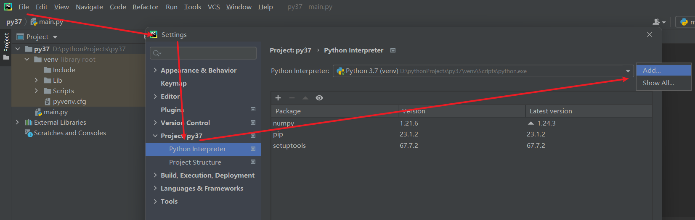


## 3.2 编辑器Jupyter


# 4. 常用库(函数)

## 4.0 python

### 4.0.1 for i,x in enumerate(xxx)

enumerate() 函数用于将一个可遍历的数据对象(如列表、元组或字符串)组合为一个索引序列，同时列出数据和数据下标，一般用在 for 循环当中

```py
seq = ['one', 'two', 'three']
 for i, element in enumerate(seq):
...     print i, element
... 
0 one
1 two
2 three
```

#### 4.0.1.1 应用:类别名转数字标签

数据集是kaggle的dog breed这个竞赛中的标签文件，名为`'labels.csv'`，前5行如下：

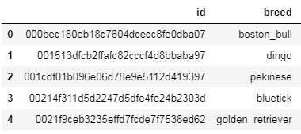

```py
class_df = pd.read_csv('labels.csv')
class_df.head()
class_to_idx = {x:i for i,x in enumerate(class_df.breed.unique())}
idx_to_class = {i:x for i,x in enumerate(class_df.breed.unique())}
```


## 4.1 os库

### 4.1.1 os.path

os.path 模块是系统路径操作模块，其中，斜杠("/")是 linux 系统下的路径分隔符，和反斜杠("\")是 windows 系统下的路径分隔符。

也就是说，只要提供一个包含斜杠和反斜杠的字符串，os.path 模块都能处理，哪怕该字符串不是一个有效的真正路径，因为 os.path 模块的源码实现就是根据操作系统来处理斜杠和反斜杠的操作的。

#### os.path.join**(path1, path2, ...)**

路径合并函数，这个函数会把所有参数合并成一个路径字符串，其中除了最后一个参数之外，其它所有参数都会自动在字符串末尾添加目录分隔符(斜杠或者反斜杠)，linux系统下默认添加斜杠，windows下默认添加一个反斜杠

#### os.path.abspath(path)

*获取文件当前目录的绝对路径*

```py
import os
 
print(os.path.abspath(".")) #当前目录的绝对路径
 
print(os.path.abspath(r"..")) #上级目录的绝对路径
 
print(os.path.abspath(r"D:\python_workshop\python6\revise\函数.py"))
```

##### 获取当前目录上一级目录路径

```py
print(os.path.abspath(os.path.join(os.getcwd(), "..")))
```


### 4.1.2 os模块常用函数

#### [os.listdir(path)](https://www.runoob.com/python3/python3-os-listdir.html) 

返回path指定的文件夹包含的文件或文件夹的名字的list。

```python
import os
path = "dataset\\train\\ants"
img_path_list = os.listdir(path) 
```

os.getcwd( )

```py
#getcwd()：该函数不需要传递参数，获得当前所运行脚本的路径
```


## 4.2 [Pillow(PIL)](https://blog.csdn.net/weixin_43790276/article/details/108478270?ydreferer=aHR0cHM6Ly9jbi5iaW5nLmNvbS8%3D)

#### 安装 pip install pillow

```python
#导包时要用PIL来导入，而不能用pillow或Pillow
import PIL 或
from PIL import Image
```

#### Image.open() 、Image.show() 

```python
from PIL import Image
 
image = Image.open("yazi.jpg")
image.show()
#注意，如果图片是png格式，则有4个通道(RGB+一个透明通道)，在处理时还需要加上:
image = image.convert('RGB')
#并且，不同截图软件截图保存的通道数不同

#转换成tensor格式
image = transform(image)
```


## 4.3 pytorch

*pytorch可以说是torch的python版，并增加了很多新功能*

*安装pytorch*：

进入pytorch官网选择对应配置进行安装

```py
#进入对应虚拟环境
conda activate xxx
#独显安装：
#这里若python为3.6，安装1.8.1
conda install pytorch==1.8.1 torchvision==0.9.1 torchaudio==0.8.1 cudatoolkit=10.2
conda install pytorch torchvision torchaudio pytorch-cuda=11.7

#核显安装选cpu=none选项

#检测安装是否成功
import torch 
print(torch.__version__)    #显示版本
print("gpu", torch.cuda.is_available())  #gpu TRUE
```


### 4.3.1 [Dataset、DataLoader](https://blog.csdn.net/weixin_44211968/article/details/123744513?ops_request_misc=%257B%2522request%255Fid%2522%253A%2522169405322416800186594999%2522%252C%2522scm%2522%253A%252220140713.130102334..%2522%257D&request_id=169405322416800186594999&biz_id=0&utm_medium=distribute.pc_search_result.none-task-blog-2~all~top_positive~default-1-123744513-null-null.142^v93^insert_down28v1&utm_term=torch%20Dataset&spm=1018.2226.3001.4187)

训练模型一般都是先处理 **数据的输入问题** 和 **预处理问题** 。Pytorch提供了几个有用的工具：torch.utils.data.Dataset 类和 torch.utils.data.DataLoader 类 。

流程是先把原始数据转变成 torch.utils.data.Dataset 类，随后再把得到的 torch.utils.data.Dataset 类当作一个参数传递给 torch.utils.data.DataLoader 类，得到一个数据加载器，这个数据加载器每次可以返回一个 Batch 的数据供模型训练使用。

在 pytorch 中，提供了一种十分方便的数据读取机制，即使用 torch.utils.data.Dataset 与 Dataloader 组合得到数据迭代器。在每次训练时，利用这个迭代器输出每一个 batch 数据，并能在输出时对数据进行相应的预处理或数据增广操作。

#### Dataset

Dataset 是一个 **数据集** 抽象类，它是其他所有数据集类的父类（所有其他数据集类都应该继承它），继承时需要重写方法 `__len__` 和 `__getitem__` ， `__len__` 是提供数据集大小的方法， `__getitem__` 是可以通过索引号找到数据的方法。

以下是一个简单的自定义数据集类重写demo

```py
class MyDataset(Dataset):
    root_dir = ''
    label_dir = ''
    path = ''
    img_path_list = ''
    
    def __init__(self,root_dir,label_dir):
        ...
    
    def __getitem__(self,idx):
        img_name = self.img_path_list[idx]
        img_item_path = os.path.join(...)
    	img = Image.open(img_item_path)
        label = self.label_dir
        return img,label
    
    def __len__(self):
        return len(img_path_list)
```

​			

## 4.4 torch.utils.tenserBoard

### 4.4.1 介绍

TensorBoard 是一组用于[数据可视化)的工具。TensorBoard 包含在 TensorFlow 库中，可以直接用，但在pytorch中不行，pytorch要单独安装 TensorBoard 可以使用**pip install tensorboard**

安装

```py
pip install tensorboard
```


### 4.4.2 基本使用

#### 1 标量展示writer.add_scalar

```py
from torch.utils.tensorboard import SummaryWriter

writer = SummaryWriter("logs")
#y=x
for i in range(100):
    writer.add_scalar("y=2x",2i,i)  #展示y=2x函数图像

writer.close()
```

#### 2 图像展示add_image

```py
from torch.utils.tensorboard import SummaryWriter            tensorboard可视化库
import numpy as np								PIL类型不能直接被writer读取，转成numpy
from PIL import Image							用于导入图片

writer = SummaryWriter("logs")

image_path="D:\Pytorch_learn_project\data\\train\\ants_image\\24335309_c5ea483bb8.jpg"   图片路径
img_PIL= Image.open(image_path)         根据上述路径打开图片
img_array = np.array(img_PIL)			转为numpy类型，方便按照numpy类型保存图片的数据信息

#使用writer.add_image()函数展示图片，最后关闭writer()，这里不是默认的CHW形状，这里需记得标明数据的形状
writer.add_image("test1",img_array,2,dataformats='HWC')#2是步长
writer.close()

```

#### 3 终端启用tensorboard

```py
#在终端输入命令启用tensorboard的web端
#记住一定要在对应文件的上级目录的终端
tensorboard --logdir=要保存的目标目录 --port=6007
```

#### 4 web端查看图像事项

***深色线：平滑处理；浅色线：真实曲线***

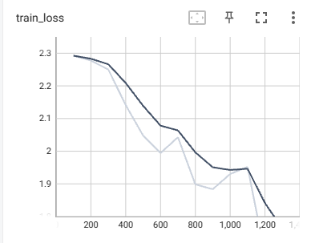


## 4.5 torch.tensor

在[神经网络](https://so.csdn.net/so/search?q=神经网络&spm=1001.2101.3001.7020)的计算中，数据都是以tensor（张量）的形式进行传递和运算的.
tensor是对一类数学概念的一个概括：

- 0维tensor = 数字 = 标量
- 1维tensor = 序列 = 向量
- 2维tensor = 2维序列 = 矩阵
- n维tensor = n维序列

其中n也代表了访问tensor中某个元素所需要的indexs的数量，例如对于一个2维的tensor:

> a = [
> [1, 2],
> [3, 4]
> ]

当我们想要访问3这个元素时候需要输入:a[1] [0] 得到3

可以看到，需要2个indexs.

Tensor中除了数据，还包装了神经网络中如梯度等的一些基本属性，所以说数据在神经网络中一定要转换成tensor型再进行训练

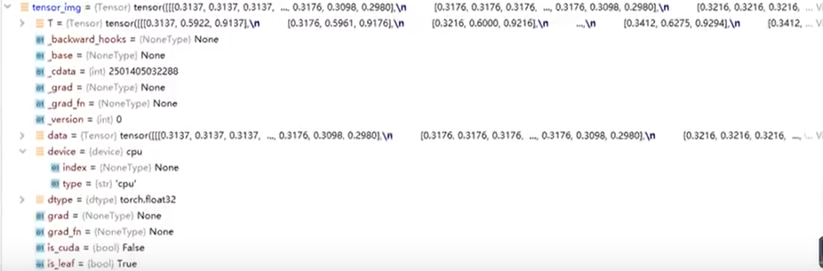

### 4.5.1 tensor与Tensor的区别

首先，torch.Tensor是一个类，所有的tensor都是Tensor的一个实例；而torch.tensor是一个函数。这也说明了为什么使用torch.Tensor()没有问题而torch.tensor()却有问题。
其次，torch.tensor主要是将一个data封装成tensor，并且可以指定requires_grad。
torch.tensor(data,dtype=None,device=None,requires_grad=False) - > Tensor
最后，我们更多地使用torch.tensor，我们可以通过使用torch.tensor(())来达到与torch.Tensor()同样的效果。

```py
import torch
import numpy as np

a = torch.Tensor([2,3])
print(a.dtype)  # torch.floaat32

b = torch.tensor([2,3])
print(b.dtype)  # torch.int64

c = np.array(2,3)
print(c.dtype) # int64
```

### 4.5.2 tensor的一些操作

#### 1 cat()

```py
#实现拼接
b=torch.randn(3,3)
print(b)
tensor([[-0.0733, -0.4884,  0.9050],
        [-1.2613,  0.8577,  0.2139],
        [ 0.3336, -1.9796, -0.1387]])

e=torch.cat((b,b), dim=0) #dim=0是按行拼接
>>>e
tensor([[-0.0733, -0.4884,  0.9050],
        [-1.2613,  0.8577,  0.2139],
        [ 0.3336, -1.9796, -0.1387],
        [-0.0733, -0.4884,  0.9050],
        [-1.2613,  0.8577,  0.2139],
        [ 0.3336, -1.9796, -0.1387]])


d=torch.cat((b,b),dim=1)  #维度为1是按列拼接
print(d)
tensor([[-0.0733, -0.4884,  0.9050, -0.0733, -0.4884,  0.9050],
        [-1.2613,  0.8577,  0.2139, -1.2613,  0.8577,  0.2139],
        [ 0.3336, -1.9796, -0.1387,  0.3336, -1.9796, -0.1387]])
```


### 4.5.3 tensor的属性

#### 1 梯度相关

**requires_grad**: 如果需要为张量计算梯度，则为True，否则为False。我们使用[pytorch](https://so.csdn.net/so/search?q=pytorch&spm=1001.2101.3001.7020)创建tensor时，可以指定requires_grad为True（默认为False）

**grad_fn**： grad_fn用来记录变量是怎么来的，方便计算梯度，y = x*3,grad_fn记录了y由x计算的过程。

**grad**：当执行完了backward()之后，通过x.grad查看x的梯度值。

```py
>>x = torch.ones(2, 2, requires_grad=True)
 
tensor([[1., 1.],
 
        [1., 1.]], requires_grad=True)
 
>>print(x.grad_fn)  # None
------------------------------------------------
>>y = x + 2
tensor([[3., 3.],
 
        [3., 3.]], grad_fn=<AddBackward>)
 
>>print(y.grad_fn)  # <AddBackward object at 0x1100477b8>
```

注意：grad在反向传播过程中是累加的(accumulated)，这意味着每一次运行反向传播，梯度都会累加之前的梯度，所以一般在反向传播之前需把梯度清零。


#### 2 item()

```py
import torch
a = torch.tensor(5)

print(a) #tensor(5)
print(a.item()) # 5
```


## 4.6 torchvision/torch

torchvision 工具库是 pytorch 框架下常用的图像视频处理包，可以用来生成图片和视频数据集（torchvision.datasets），做一些图像预处理(torchvision.transforms)，导入预训练模型(torchvision.models)，以及生成和保存图像（torchvision.utils）。

### 4.6.1 torchvision.transforms

transforms函数对图像做预处理可以是：归一化(normalize)，尺寸剪裁(resize)，翻转(flip) 等。

上面的这些步骤实际操作起来往往是一系列的，此时可以用compose将这些图像预处理操作连起来。

#### 1 transforms.ToTensor

````py
- 可以将PIL和numpy.ndarry格式的数据从[0,255]范围转换到[0,1] ，其实内部就是将原始数据直接除以255。
- 另外原始数据的shape是（H x W x C），通过`transforms.ToTensor()`后shape会变为（C x H x W）。

```py
import cv2
import numpy as np
import torch
from torchvision import transforms

#原始数据模型
data = np.array([
                [[1,1,1],[1,1,1],[1,1,1],[1,1,1],[1,1,1]],
                [[2,2,2],[2,2,2],[2,2,2],[2,2,2],[2,2,2]],
                [[3,3,3],[3,3,3],[3,3,3],[3,3,3],[3,3,3]],
                [[4,4,4],[4,4,4],[4,4,4],[4,4,4],[4,4,4]],
                [[5,5,5],[5,5,5],[5,5,5],[5,5,5],[5,5,5]]
        ],dtype='uint8')

#toTensor转换
data = transforms.ToTensor()(data)

#输出
print(data)
print(data.shape) #torch.Size([3, 5, 5])CHW
--------------------------------------------------------
#1/255=0.0039
tensor([[[0.0039, 0.0039, 0.0039, 0.0039, 0.0039],
         [0.0078, 0.0078, 0.0078, 0.0078, 0.0078],
         [0.0118, 0.0118, 0.0118, 0.0118, 0.0118],
         [0.0157, 0.0157, 0.0157, 0.0157, 0.0157],
         [0.0196, 0.0196, 0.0196, 0.0196, 0.0196]],
        .......
         [[0.0039, 0.0039, 0.0039, 0.0039, 0.0039],
         [0.0078, 0.0078, 0.0078, 0.0078, 0.0078],
         [0.0118, 0.0118, 0.0118, 0.0118, 0.0118],
         [0.0157, 0.0157, 0.0157, 0.0157, 0.0157],
         [0.0196, 0.0196, 0.0196, 0.0196, 0.0196]]])
```

#ToTensor功能是将 PIL Image 类型 或者numpy.ndarray类型的图片对象转换为 tensor类型。from torchvision import transforms

#这是将PILimage类型转换成tensor类型，直接用transforms的转换工具
from PIL import Image
from torchvision import transforms

img_path = "testdata/train/ants_image/6743948_2b8c096dda.jpg"
img = Image.open(img_path)
tensor_tool = transforms.ToTensor()
tensor_img = tensor_tool(img)
print(tensor_img)

#这先得到numpy.ndarry类型再转换成tensor类型，得到ndarry类型需要使用opencv（cv2）
````

#### 2 [transforms.Normalize](https://blog.csdn.net/qq_40507857/article/details/116600119?ops_request_misc=%257B%2522request%255Fid%2522%253A%2522169448288016800227484660%2522%252C%2522scm%2522%253A%252220140713.130102334..%2522%257D&request_id=169448288016800227484660&biz_id=0&utm_medium=distribute.pc_search_result.none-task-blog-2~all~top_positive~default-1-116600119-null-null.142^v93^insert_down28v1&utm_term=transforms.normalize&spm=1018.2226.3001.4187&ydreferer=aHR0cHM6Ly9zby5jc2RuLm5ldC9zby9zZWFyY2g%2Fc3BtPTEwMDEuMjEwMS4zMDAxLjQ0OTgmcT10cmFuc2Zvcm1zLm5vcm1hbGl6ZSZ0PSZ1PQ%3D%3D)


可以看到这个函数的输出`output[channel] = (input[channel] - mean[channel]) / std[channel]`。这里[channel]的意思是指对特征图的每个通道都进行这样的操作。【mean为均值，std为标准差】

这里的第一个参数（0.5，0.5，0.5）表示每个通道的均值都是0.5，第二个参数（0.5，0.5，0.5）表示每个通道的方差都为0.5。【因为图像一般是三个通道，所以这里的向量都是1x3的🍵🍵🍵】有了这两个参数后，当我们传入一个图像时，就会按照上面的公式对图像进行变换。【**注意：这里说图像其实也不够准确，因为这个函数传入的格式不能为PIL Image，我们应该先将其转换为Tensor格式**】说了这么多，那么这个函数到底有什么用呢？我们通过前面的ToTensor已经将数据归一化到了0-1之间，现在又接上了一个Normalize函数有什么用呢？其实Normalize函数做的是将数据变换到了[-1,1]之间。之前的数据为0-1，当取0时，output =（0 - 0.5）/ 0.5 = -1；当取1时，output =（1 - 0.5）/ 0.5 = 1。这样就把数据统一到了[-1，1]之间了🌱🌱🌱那么问题又来了，数据统一到[-1，1]有什么好处呢？数据如果分布在(0,1)之间，可能实际的bias，就是神经网络的输入b会比较大，而模型初始化时b=0的，这样会导致神经网络收敛比较慢，经过Normalize后，可以加快模型的收敛速度。【这句话是再网络上找到最多的解释，自己也不确定其正确性】

  读到这里大家是不是以为就完了呢？这里还想和大家唠上一唠🍓🍓🍓上面的两个参数（0.5，0.5，0.5）是怎么得来的呢？这是根据数据集中的数据计算出的均值和标准差，所以往往不同的数据集这两个值是不同的
————————————————

经过上面normalize()的变换后变成了均值为0 方差为1（其实就是最大最小值为1和-1）

每个样本图像变成了均值为0 方差为1 的标准正态分布，这就是最普通（科学研究价值最大的）的样本数据了


#### 3 [transforms.Resize()](https://blog.csdn.net/qq_35008185/article/details/118224044?ops_request_misc=&request_id=&biz_id=102&utm_term=transforms.resize&utm_medium=distribute.pc_search_result.none-task-blog-2~all~sobaiduweb~default-1-118224044.nonecase&spm=1018.2226.3001.4187)

调整**PILImage对象**的尺寸，或结合Compose([...])使用

> 提示：不能是用**io.imread或者cv2.imread**读取的图片，这两种方法得到的是**ndarray**。

```py
#同时指定长宽
transforms.Resize([h, w])
#将图片缩放至x，长宽比保持不变
transforms.Resize(x)
```


#### 4 [transforms.RandomCrop()](https://blog.csdn.net/u011995719/article/details/85107009?ops_request_misc=%257B%2522request%255Fid%2522%253A%2522169460376016800197090384%2522%252C%2522scm%2522%253A%252220140713.130102334..%2522%257D&request_id=169460376016800197090384&biz_id=0&utm_medium=distribute.pc_search_result.none-task-blog-2~all~sobaiduend~default-2-85107009-null-null.142^v93^insert_down28v1&utm_term=transforms.randomcrop%28%29&spm=1018.2226.3001.4187)

```py
class torchvision.transforms.RandomCrop(size, padding=None, pad_if_needed=False, fill=0, padding_mode=‘constant’)
'''
功能：依据给定的size随机裁剪
参数：
size- (sequence or int)，若为sequence,则为(h,w)，若为int，则(size,size)

padding-(sequence or int, optional)，此参数是设置填充多少个pixel。
当为int时，图像上下左右均填充int个，例如padding=4，则上下左右均填充4个pixel，若为3232，则会变成4040。
当为sequence时，若有2个数，则第一个数表示左右扩充多少，第二个数表示上下的。当有4个数时，则为左，上，右，下。

fill- (int or tuple) 填充的值是什么（仅当填充模式为constant时有用）。int时，各通道均填充该值，当长度为3的tuple时，表示RGB通道需要填充的值。

padding_mode- 填充模式，这里提供了4种填充模式，1.constant，常量。2.edge 按照图片边缘的像素值来填充。				  3.reflect，暂不了解。 4. symmetric，暂不了解。
'''
```

————————————————

#### 5 transforms.Compose()

一般用Compose**把多个步骤整合到一起**：

```py
transforms.Compose([
 
    transforms.CenterCrop(10),
    transforms.ToTensor(),
 
])

#也可以提前定义再直接放进去
trans_toTensor = transforms.ToTensor()
trans_crop = transforms.CenterCrop(10)
transforms.Compose([trans_crop, trans_toTensor])
```


### 4.6.2 torchvision.datasets

#### 4.6.2.1 数据集

##### COCO：目标检测，语义分割

##### MNIST：手写文字

##### CIFAR：物体识别

```py
CIFAR10的10个classes：airplane,automobile,bird,cat,deer,dog,frog,horse,ship,truck
```

```py
torchvision.datasets.CIFAR10(root: str, train: bool = True, transform: Optional[Callable] = None, target_transform: Optional[Callable] = None, download: bool = False)
root:目录
transform：是否需要transforms处理图片
download若为true，则会从网上自动下载数据集，否则要自己下载，一般设置为true
```

```py
import torchvision
from torch.utils.tensorboard import SummaryWriter

dataset_transform = torchvision.transforms.Compose([
    torchvision.transforms.ToTensor()
])

#datasets若发现数据集已经下载并校验通过，则不会重新下载
train_set = torchvision.datasets.CIFAR10(root="./dataset", train=True, transform=dataset_transform, download=True)
test_set = torchvision.datasets.CIFAR10(root="./dataset", train=False, transform=dataset_transform, download=True)


print(test_set[0])#(<PIL.Image.Image image mode=RGB size=32x32 at 0x2176E5FD0C8>, 3)

print(test_set.classes) #airplane,automobile,bird,cat,deer,dog,frog,horse,ship,truck

img, target = test_set[0]
print(img)#<PIL.Image.Image image mode=RGB size=32x32 at 0x2541358AA88>
print(target)#3
print(test_set.classes[target])#cat

#画图
writer = SummaryWriter('summary_event')
for i in range(10):
    set_img, target = test_set[i]
    writer.add_image('cifar10', set_img, i)
```


#### 4.6.2.2 [torchvision.datasets.ImageFolder](https://blog.csdn.net/weixin_43135178/article/details/115139178?ops_request_misc=%257B%2522request%255Fid%2522%253A%2522169698699016800197077224%2522%252C%2522scm%2522%253A%252220140713.130102334..%2522%257D&request_id=169698699016800197077224&biz_id=0&utm_medium=distribute.pc_search_result.none-task-blog-2~all~top_positive~default-1-115139178-null-null.142^v95^insert_down28v1&utm_term=datasets.ImageFolder&spm=1018.2226.3001.4187)

mageFolder是一个通用的数据加载器，它要求我们以下面这种格式来组织数据集的训练、验证或者测试图片。

```py
root/dog/xxx.png
root/dog/xxy.png
root/dog/xxz.png
 
root/cat/123.png
root/cat/nsdf3.png
root/cat/asd932_.png
```

root一般都是如下这种形式：./data/train 和 ./data/valid

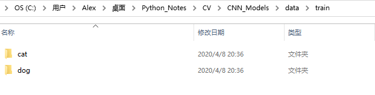

ImageFolder参数

```py
dataset=torchvision.datasets.ImageFolder(
                       root, transform=None, 
                       target_transform=None, 
                       loader=<function default_loader>, 
                       is_valid_file=None)
---------------------------------------------------------
#案例
from torchvision.datasets import ImageFolder
from torchvision import transforms
 
#加上transforms
normalize=transforms.Normalize(mean=[.5,.5,.5],std=[.5,.5,.5])
transform=transforms.Compose([
    transforms.RandomCrop(180),
    transforms.RandomHorizontalFlip(),
    transforms.ToTensor(), #将图片转换为Tensor,归一化至[0,1]
    normalize
])
 
dataset=ImageFolder('./data/train',transform=transform)

print(dataset[0])
'''
输出：
(tensor([[[-0.5137, -0.4667, -0.4902,  ..., -0.0980, -0.0980, -0.0902],
         [-0.5922, -0.5529, -0.5059,  ..., -0.0902, -0.0980, -0.0667],
         [-0.5373, -0.5294, -0.4824,  ..., -0.0588, -0.0824, -0.0196],
         ...,
         [-0.3098, -0.3882, -0.3725,  ..., -0.4353, -0.4510, -0.4196],
         ...
```


### 4.6.3 torch.nn

#### nn.Module

提供了一些比较常见的神经网络，包括预训练的

自定义神经网络，继承nn.Module时，需要重写init和forward函数

***自定义一个类，继承自Module类，并且一定要实现两个基本的函数，第一是构造函数init，第二个是层的逻辑运算函数，即所谓的前向计算函数forward函数。***

```py
#自定义一个类，继承自Module类，并且一定要实现两个基本的函数，第一是构造函数__init__，第二个是层的逻辑运算函数，即所谓的前向计算函数forward函数。
import torch
from torch import nn

class Tudui(nn.Module):
    def __init__(self):
        super().__init__()
    
    def forward(self, input):
        out = inout + 1
        return output
```


#### nn.functional.conv2d

```py
#输入参数，主要还是input， kernel, stride
def conv2d(input: Tensor, weight: Tensor, bias: Optional[Tensor]=None, 
           stride: Union[_int, _size]=1, padding: Union[_int, _size]=0, 
           dilation: Union[_int, _size]=1, groups: _int=1) -> Tensor: ...，
```

```py
import torch

input = torch.tensor([
    [1, 2, 0, 3, 1],
    [0, 1, 2, 3, 1],
    [1, 2, 1, 0, 0],
    [5, 2, 3, 1, 1],
    [2, 1, 0, 1, 1]
])

kernel = torch.tensor([
    [1, 2, 1],
    [0, 1, 0],
    [2, 1, 0]
])

input = torch.reshape(input, (1, 1, 5, 5))
kernel = torch.reshape(kernel, (1, 1, 3, 3))

torch.nn.functional.conv2d(input, kernel, stride=1)
```

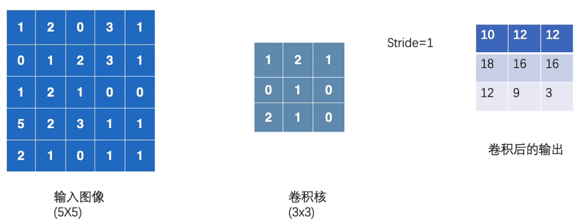


#### [nn.Conv2d](https://blog.csdn.net/qq_34243930/article/details/107231539?ops_request_misc=%257B%2522request%255Fid%2522%253A%2522169474775616800211533990%2522%252C%2522scm%2522%253A%252220140713.130102334..%2522%257D&request_id=169474775616800211533990&biz_id=0&utm_medium=distribute.pc_search_result.none-task-blog-2~all~top_positive~default-1-107231539-null-null.142^v94^insert_down28v1&utm_term=nn.CONV2d&spm=1018.2226.3001.4187&ydreferer=aHR0cHM6Ly9zby5jc2RuLm5ldC9zby9zZWFyY2g%2Fc3BtPTEwMDEuMjEwMS4zMDAxLjQ0OTgmcT1ubi5DT05WMmQmdD0mdT0%3D)

```py
#参数详解
torch.nn.Conv2d(in_channels, out_channels, kernel_size, stride=1, padding=0, dilation=1, groups=1, bias=True)
```

output的H,W计算公式

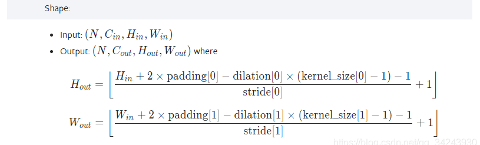

```py
import torchvision
from torch import nn
from torch.nn import Conv2d
from torch.utils.data import DataLoader

dataset = torchvision.datasets.CIFAR10("dataset", train=False,
                                       transform=torchvision.transforms.ToTensor(), download=True)

dataloader = DataLoader(dataset, batch_size=64)

print(dataset.__len__()) #10000

class Tudui(nn.Module):
    def __init__(self):
        super(Tudui,self).__init__()
        self.conv1 = Conv2d(in_channels=3, out_channels=6, kernel_size=3, stride=1, padding=0)

    #在前向传播forward函数里面实现前向运算。
    def forward(self, x):
        x = self.conv1(x)
        return x

tudui = Tudui()

for data in dataloader:
    imgs, targets = data
    output = tudui(imgs)
    print(imgs.shape) #torch.Size([64, 3, 32, 32])
    print(output.shape) #torch.Size([64, 6, 30, 30])--->这里输出通道变成了6，根据上图公式，tensor尺寸也被压缩
    
    #若要进行tensorboard，则需进行reshape，因为图片的显示是3通道
    torch.reshape(output, (-1,3,30,30))
```


#### nn.MaxPool2d

作用:
*对邻域内特征点取最大*
减小**卷积层参数误差**造成估计**均值的偏移**的误差，更多的保留纹理信息。

```py
#参数 一般只填size
MaxPool2d(kernel_size, stride=None, padding=0, dilation=1, return_indices=False, ceil_mode=False)

#stride 默认值是 kernel_size
#dilation (int or tuple, optional)【可选】：一个控制窗口中元素步幅的参数
#ceil_mode (bool)【可选】：如果等于True，计算输出信号大小的时候，如果超出范围也会计算，会使用向上取整，代替默认的向下取整的操作
```


#### nn.ReLU/nn.Sigmoid

```py
torch.nn.ReLU(inplace=False)
```


#### [nn.Linear](https://blog.csdn.net/sazass/article/details/123568203?ops_request_misc=%257B%2522request%255Fid%2522%253A%2522169508710916800185813549%2522%252C%2522scm%2522%253A%252220140713.130102334..%2522%257D&request_id=169508710916800185813549&biz_id=0&utm_medium=distribute.pc_search_result.none-task-blog-2~all~sobaiduend~default-2-123568203-null-null.142^v94^insert_down28v1&utm_term=torch%20linear&spm=1018.2226.3001.4187)

Linear运算的本质就是多维（矩阵）的乘法加偏置

```py
torch.nn.Linear(in_features, # 输入的神经元个数
           out_features, # 输出神经元个数
           bias=True # 是否包含偏置
           )
'''
in_feature： int型, 在forward中输入Tensor最后一维(第三位)的通道数

out_feature： int型, 在forward中输出Tensor最后一维的通道数

bias: bool型， Linear线性变换中是否添加bias偏置
'''
```

```py
#示例
X = torch.Tensor([
    [0.1,0.2,0.3,0.3,0.3],
    [0.4,0.5,0.6,0.6,0.6],
    [0.7,0.8,0.9,0.9,0.9],
])
>>>X
tensor([[0.1000, 0.2000, 0.3000, 0.3000, 0.3000],
        [0.4000, 0.5000, 0.6000, 0.6000, 0.6000],
        [0.7000, 0.8000, 0.9000, 0.9000, 0.9000]])
#定义模型-------------------------------------------
model = nn.Linear(in_features=5, out_features=10, bias=True)

model(X).size()#torch.Size([3, 10])
```


#### nn.Sequential

一个序列容器，用于搭建神经网络的模块被按照被传入构造器的顺序添加到nn.Sequential()容器中。

利用nn.Sequential()搭建好模型架构，模型前向传播时调用forward()方法，模型接收的输入首先被传入nn.Sequential()包含的第一个网络模块中。然后，第一个网络模块的输出传入第二个网络模块作为输入，按照顺序依次计算并传播，直到nn.Sequential()里的最后一个模块输出结果。

***这里以如下CIFAR10的一个分类模型为例，将模型进行搭建：***

***可以看出最后生成了一个长度为10的tensor，正好对应该数据集的10个classes***

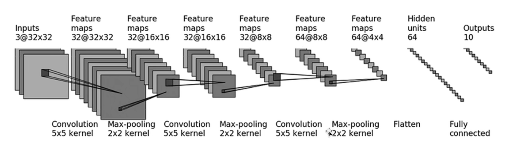

```py
from torch import nn
from torch.nn import Sequential, Conv2d, MaxPool2d, Flatten, Linear


class Tudui(nn.Module):
    def __init__(self):
        super(Tudui, self).__init__()
        self.model = Sequential(
            Conv2d(3, 32, 5, padding=2),
            MaxPool2d(2),
            Conv2d(32, 32, 5, padding=2),
            MaxPool2d(2),
            Conv2d(32, 64, 5, padding=2),
            MaxPool2d(2),
            Flatten(),
            Linear(1024, 64),
            Linear(64, 10)
        )

    def forward(self, x):
        s = self.model(x)
        return x
    
tudui = Tudui()
input = torch.ones(64, 3, 32, 32)
output = tudui(input)
print(output.shape)

#可以通过tensorboard进行网络模型可视化
writer = SummaryWriter('./logs_model')
writer.add_graph(tudui, input)
writer.close()
```


#### nn.L1Loss()

L1Loss 计算方法比较简单，原理就是取预测值和真实值的绝对误差的平均数。计算公式如下


```py
#损失函数nn.L1Loss()   作用其实就是计算网络输出与标签之差的绝对值，返回的数据类型可以是张量，也可以是标量。
#参数可以设置取不取平均值
nn.L1Loss(size_average=True, reduce=False,reduction='mean')
```

```py
# output 为网络的输出
# target 为目标输出即对应输入真实的标签
output = torch.ones(2, 3, requires_grad=True)*2.5
target = torch.ones(1, 3)

LOSSresult = nn.L1Loss()
result = LOSSresult(output, target)
 
print('求平均:{}'.format(result))
```


#### **nn.MSELoss**

nn.MSELoss：计算公式是预测值和真实值之间的平方和的平均数。


```py
torch.nn.MSELoss(size_average=None, reduce=None, reduction='mean')
```

```py

outputs = torch.tensor([1, 2, 3], dtype=torch.float32)
targets = torch.tensor([1, 2, 5], dtype=torch.float32)

outputs = torch.reshape(outputs, (1,1,1,3))
targets = torch.reshape(targets, (1,1,1,3))

loss_mse = MSELoss()
result_mse = loss_mse(inputs, targets)

print(result_mse) #Tensor(1.333)  --->  (0+0+(3-5)^2)/3=4/3=1.333
```


#### nn.CrossEntropyLoss

nn.CrossEntropyLoss是[pytorch](https://so.csdn.net/so/search?q=pytorch&spm=1001.2101.3001.7020)下的**交叉熵损失函数**，用于分类任务使用

> 损失函数的两大作用：
>
> 1. 计算实际输出和目标之间的差距
> 2. 为我们更新输出提供一定的依据（通过反向传播）

计算公式：x就是网络的outputs，可以看出，要检测的对应值概率越大，-x[class]就减的越多，计算出来的损失就越小

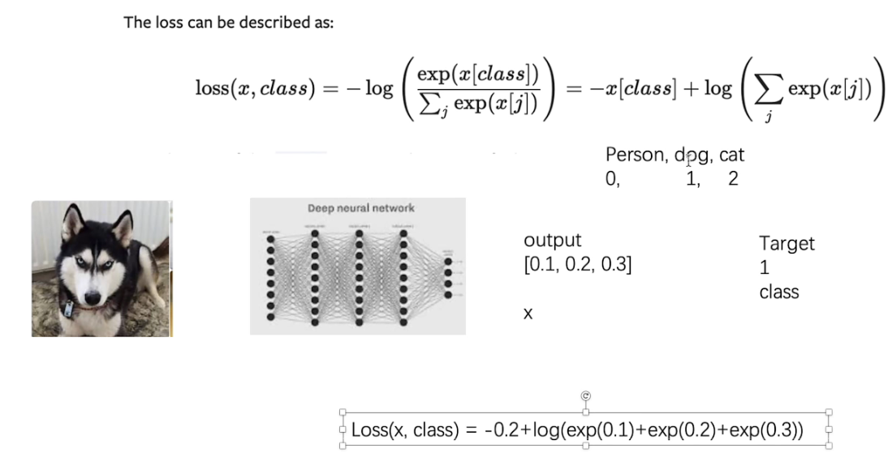


```py
#功能：创建一个交叉熵损失函数：
#一般默认不填参数
torch.nn.CrossEntropyLoss(weight=None, ignore_index=-100, reduction='mean', label_smoothing=0.0)
```

```py

loss = nn.CrossEntropyLoss()

tudui = Tudui()

for data in dataLoader:
    imgs, targets = data
    outputs = tudui(imgs)
    #计算每个batch_size输出和标签的损失
    result_loss = loss(outputs, tagets)
    print(result_loss)
```


#### [nn.Softmax()](https://blog.csdn.net/nefetaria/article/details/114411953?ops_request_misc=%257B%2522request%255Fid%2522%253A%2522169502603716800185890599%2522%252C%2522scm%2522%253A%252220140713.130102334..%2522%257D&request_id=169502603716800185890599&biz_id=0&utm_medium=distribute.pc_search_result.none-task-blog-2~all~baidu_landing_v2~default-7-114411953-null-null.142^v94^insert_down28v1&utm_term=nn.Softmax%28%29&spm=1018.2226.3001.4187)

```py
tf.nn.softmax(
    logits, # 输入：全连接层（往往是模型的最后一层）的值，一般代码中叫做logits
    axis = None,
    name = None
    dim = None
)
```

作用：softmax函数的作用就是归一化。
输入：全连接层（往往是模型的最后一层）的值，一般代码中叫做logits
输出：归一化的值，含义是属于该位置的概率，一般代码叫做probs,例如输出[0.4, 0.1, 0.2, 0.3],那么这个样本最可能属于第0个位置，也就是第0类。这是由于logits的维度大小就设定的任务的类别，所以第0个位置就代表第0类。softmax函数的输出不改变维度的大小。(该样本属于各个类的概率)
用途：如果做单分类的问题，那么输出的值就取top1(最大, argmax)； 如果做多分类问题，那么输出的值就取topN。


#### nn.BatchNorm2d( )

```py
torch.nn.BatchNorm2d(num_features, eps=1e-05, momentum=0.1, affine=True, track_running_stats=True, device=None, dtype=None)
#num_features：输入图像的通道数量-C。
#track_running_stats：BatchNorm2d中存储的的均值和方差是否需要更新，若为True，表示需要更新；反之不需要更新。默认就好
```

功能：对输入的四维数组进行批量标准化处理

对于**所有的batch**中样本的**同一个channel**的数据元素进行标准化处理，即如果有C个通道，无论batch中有多少个样本，都会在通道维度上进行标准化处理，一共进行C次。


### 4.6.4 [result_loss.backward()](https://blog.csdn.net/sinat_28731575/article/details/90342082?ops_request_misc=%257B%2522request%255Fid%2522%253A%2522169503593016800185840467%2522%252C%2522scm%2522%253A%252220140713.130102334..%2522%257D&request_id=169503593016800185840467&biz_id=0&utm_medium=distribute.pc_search_result.none-task-blog-2~all~sobaiduend~default-1-90342082-null-null.142^v94^insert_down28v1&utm_term=pytorch%20backword&spm=1018.2226.3001.4187)

将损失loss向输入测进行反向传播，得到每个tensor内部要更新参数(optimizer.step())对应的一个梯度参数

```py
result_loss = loss(outputs, targets)
#使用反向传播同时计算梯度
result_loss.backward() #这行运行完后就会更新模型内的grad
```


### 4.6.5 [torch.norm()](https://blog.csdn.net/qq_36556893/article/details/90698186?ops_request_misc=%257B%2522request%255Fid%2522%253A%2522169508938916800225511162%2522%252C%2522scm%2522%253A%252220140713.130102334..%2522%257D&request_id=169508938916800225511162&biz_id=0&utm_medium=distribute.pc_search_result.none-task-blog-2~all~sobaiduend~default-2-90698186-null-null.142^v94^insert_down28v1&utm_term=torch%20norm&spm=1018.2226.3001.4187)

`torch.norm()` 是 PyTorch 中的一个函数，用于计算输入张量沿指定维度的[范数](https://so.csdn.net/so/search?q=范数&spm=1001.2101.3001.7020)。具体而言，当给定一个输入张量 `x` 和一个整数 `p` 时，`torch.norm(x, p)` 将返回输入张量 `x` 沿着最后一个维度（默认为所有维度）上所有元素的 `p` 范数。

[什么是范数？](https://blog.csdn.net/zhaohongfei_358/article/details/122818616?ops_request_misc=%257B%2522request%255Fid%2522%253A%2522169503825316800188522280%2522%252C%2522scm%2522%253A%252220140713.130102334..%2522%257D&request_id=169503825316800188522280&biz_id=0&utm_medium=distribute.pc_search_result.none-task-blog-2~all~top_positive~default-1-122818616-null-null.142^v94^insert_down28v1&utm_term=%E8%8C%83%E6%95%B0&spm=1018.2226.3001.4187)

```py
#参数
def norm(input, p=2, dim=None, keepdim=False, out=None, dtype=None):
    
'''
input：输入tensor类型的数据

p：指定的范数，默认为p=‘fro’，计算矩阵的Frobenius norm (Frobenius 范数)，就是矩阵各项元素的绝对值平方的总和。
p='nuc’时，  是求核范数，核范数是矩阵奇异值的和。（不常用）
p为int的形式，是求p-范数。（常用）

dim：指定在哪个维度进行，如果不指定，则是在所有维度进行计算

keepdim：True or False，如果True，则保留dim指定的维度，False则不保留

out：输出的 tensor

dtype：指定输出的tensor的数据类型
'''
```

```py
tensor([[ 1.,  2.,  3.,  4.],
        [ 2.,  4.,  6.,  8.],
        [ 3.,  6.,  9., 12.]])

#接着我们分别对其行和列分别求2范数
inputs1 = torch.norm(inputs, p=2, dim=1, keepdim=True) #行
print(inputs1)
inputs2 = torch.norm(inputs, p=2, dim=0, keepdim=True) #列
print(inputs2)
#结果：
tensor([[ 5.4772],
        [10.9545],
        [16.4317]])
tensor([[ 3.7417,  7.4833, 11.2250, 14.9666]])
```


### 4.6.6 优化器

#### 1 [torch.optim.SGD](https://blog.csdn.net/echo_gou/article/details/119536350?ops_request_misc=%257B%2522request%255Fid%2522%253A%2522169517442516800197019450%2522%252C%2522scm%2522%253A%252220140713.130102334..%2522%257D&request_id=169517442516800197019450&biz_id=0&utm_medium=distribute.pc_search_result.none-task-blog-2~all~top_positive~default-1-119536350-null-null.142^v94^insert_down28v1&utm_term=optim.SGD&spm=1018.2226.3001.4187)

其中的SGD就是optim中的一个算法（优化器）：**随机梯度下降算法**

为了使用torch.optim，你需要构建一个optimizer对象。这个对象能够保持当前参数状态并基于计算得到的梯度进行参数更新。

```py
#参数
optimizer = torch.optim.SGD(params, lr=<required parameter>, momentum=0, dampening=0, weight_decay=0, nesterov=False, *, maximize=False, foreach=None, differentiable=False)
'''
lr (float) – 学习率
momentum (float, 可选) – 动量因子（默认：0）
weight_decay (float, 可选) – 权重衰减（L2惩罚）（默认：0）
dampening (float, 可选) – 动量的抑制因子（默认：0）
nesterov (bool, 可选) – 使用Nesterov动量（默认：False）
'''

#一般使用
tudui = Tudui()
#学习率太小跑得太慢，太大时模型训练不稳定
optimizer = torch.optim.SGD(tudui.parameters, lr=0.01)
```

##### [**优化器的几个方法**](https://blog.csdn.net/weixin_43863869/article/details/128120719?ops_request_misc=%257B%2522request%255Fid%2522%253A%2522169517544416800192260220%2522%252C%2522scm%2522%253A%252220140713.130102334..%2522%257D&request_id=169517544416800192260220&biz_id=0&utm_medium=distribute.pc_search_result.none-task-blog-2~all~top_positive~default-1-128120719-null-null.142^v94^insert_down28v1&utm_term=optimizer.zero_grad%28%29%E7%9A%84%E4%BD%9C%E7%94%A8&spm=1018.2226.3001.4187)

```py
optimizer.step()
'''
作用：利用优化器对参数x进行调优，以随机梯度下降SGD为例，更新的公式为：x=x−lr∗(x∗grad)
，lr 表示学习率 lr ，减号表示沿着梯度的反方向进行更新；
'''

optimizer.zero_grad()
'''
作用：清0优化器关于所有参数x的累计梯度值 x∗grad
，一般在loss.backward()前使用
'''
```

一次完整的针对CIFAR10的模型训练，对每次训练迭代进行损失的计算

```py
import torch
import torchvision
from torch import nn
from torch.nn import Sequential, Conv2d, MaxPool2d, Flatten, Linear
#引入数据集和处理器
dataset = torchvision.datasets.CIFAR10('./dataset', train=False,
                                         transform=torchvision.transforms.ToTensor(), download=True)
dataLoader = torch.utils.data.DataLoader(dataset=dataset, batch_size=1)

#创建模型
class Tudui(nn.Module):
    def __init__(self):
        super(Tudui, self).__init__()
        self.model = Sequential(
            Conv2d(3, 32, 5, padding=2),
            MaxPool2d(2),
            Conv2d(32, 32, 5, padding=2),
            MaxPool2d(2),
            Conv2d(32, 64, 5, padding=2),
            MaxPool2d(2),
            Flatten(),
            Linear(1024, 64),
            Linear(64, 10)
        )

    def forward(self, x):
        x = self.model(x)
        return x


tudui = Tudui()
loss = nn.CrossEntropyLoss()
optimizer = torch.optim.SGD(tudui.parameters(), lr=0.01)

#开始训练
for epoch in range(3):
    sum_loss = 0.0
    for data in dataLoader:
        imgs, targets = data
        outputs = tudui.forward(imgs)
        #计算损失
        result_loss = loss(outputs, targets)
        #optimizer.zero_grad() 作用：清除之前积累的梯度
        # 一般在loss.backward()前使用，即清除 (x∗grad)pre
        optimizer.zero_grad()
        #反向传播，更新梯度
        result_loss.backward()
        #对每个参数进行调优
        optimizer.step()
        sum_loss += result_loss
    print(sum_loss)
```

```py
#输出
C:\Users\1\miniconda3\envs\pytorchlearn\python.exe D:\pycharmProjects\pytorchlearn\nn_optim.py 
Files already downloaded and verified
tensor(18721.0879, grad_fn=<AddBackward0>)
tensor(16111.2578, grad_fn=<AddBackward0>)
tensor(15386.7744, grad_fn=<AddBackward0>)
```

### 4.6.7 torchvision.models

#### 1  VGG(常用：VGG16/19)

##### 创建模型

```py
torchvision.models.vgg16(*, weights: Optional[VGG16_Weights] = None, progress: bool = True, **kwargs: Any) → VGG
'''
weights:要使用的训练权重,若不使用预训练，则填一个weight=None，若要使用预训练模型，则用默认(weight='VGG16_Weights.DEFAULT')
progress：如果为True，则显示下载到标准程序的进度条。默认为True
一般填这两个就行
'''
```

```py
vgg16_true = torchvision.models.vgg16( weights='DEFAULT')

vgg16_false = torchvision.models.vgg16(weights=None)

print(vgg16_true)
#---------------------------------------------------------
VGG(
  #提取特征
  (features): Sequential(
    (0): Conv2d(3, 64, kernel_size=(3, 3), stride=(1, 1), padding=(1, 1))
    (1): ReLU(inplace=True)
    (2): Conv2d(64, 64, kernel_size=(3, 3), stride=(1, 1), padding=(1, 1))
    (3): ReLU(inplace=True)
    (4): MaxPool2d(kernel_size=2, stride=2, padding=0, dilation=1, ceil_mode=False)
    (5): Conv2d(64, 128, kernel_size=(3, 3), stride=(1, 1), padding=(1, 1))
    (6): ReLU(inplace=True)
    (7): Conv2d(128, 128, kernel_size=(3, 3), stride=(1, 1), padding=(1, 1))
    (8): ReLU(inplace=True)
    (9): MaxPool2d(kernel_size=2, stride=2, padding=0, dilation=1, ceil_mode=False)
    (10): Conv2d(128, 256, kernel_size=(3, 3), stride=(1, 1), padding=(1, 1))
    (11): ReLU(inplace=True)
    (12): Conv2d(256, 256, kernel_size=(3, 3), stride=(1, 1), padding=(1, 1))
    (13): ReLU(inplace=True)
    (14): Conv2d(256, 256, kernel_size=(3, 3), stride=(1, 1), padding=(1, 1))
    (15): ReLU(inplace=True)
    (16): MaxPool2d(kernel_size=2, stride=2, padding=0, dilation=1, ceil_mode=False)
    (17): Conv2d(256, 512, kernel_size=(3, 3), stride=(1, 1), padding=(1, 1))
    (18): ReLU(inplace=True)
    (19): Conv2d(512, 512, kernel_size=(3, 3), stride=(1, 1), padding=(1, 1))
    (20): ReLU(inplace=True)
    (21): Conv2d(512, 512, kernel_size=(3, 3), stride=(1, 1), padding=(1, 1))
    (22): ReLU(inplace=True)
    (23): MaxPool2d(kernel_size=2, stride=2, padding=0, dilation=1, ceil_mode=False)
    (24): Conv2d(512, 512, kernel_size=(3, 3), stride=(1, 1), padding=(1, 1))
    (25): ReLU(inplace=True)
    (26): Conv2d(512, 512, kernel_size=(3, 3), stride=(1, 1), padding=(1, 1))
    (27): ReLU(inplace=True)
    (28): Conv2d(512, 512, kernel_size=(3, 3), stride=(1, 1), padding=(1, 1))
    (29): ReLU(inplace=True)
    (30): MaxPool2d(kernel_size=2, stride=2, padding=0, dilation=1, ceil_mode=False)
  )
  #map_location=torch.device('cpu')，意思是映射到cpu上，在cpu上加载模型，无论你这个模型从哪里训练保存的，主要是改变分辨率
  (avgpool): AdaptiveAvgPool2d(output_size=(7, 7))
  #分类器，预测用
  (classifier): Sequential(
    (0): Linear(in_features=25088, out_features=4096, bias=True)
    (1): ReLU(inplace=True)
    (2): Dropout(p=0.5, inplace=False)
    (3): Linear(in_features=4096, out_features=4096, bias=True)
    (4): ReLU(inplace=True)
    (5): Dropout(p=0.5, inplace=False)
    (6): Linear(in_features=4096, out_features=1000, bias=True)
  )
)
```

##### **修改模型**

```py
#对现有模型添加层
vgg16_true.classifier.add_module('add_Linear', nn.Linear(1000, 10))
print(vgg16_true)
---------------------------------------------
  (classifier): Sequential(
    (0): Linear(in_features=25088, out_features=4096, bias=True)
    (1): ReLU(inplace=True)
    (2): Dropout(p=0.5, inplace=False)
    (3): Linear(in_features=4096, out_features=4096, bias=True)
    (4): ReLU(inplace=True)
    (5): Dropout(p=0.5, inplace=False)
    (6): Linear(in_features=4096, out_features=1000, bias=True)
    (add_Linear): Linear(in_features=1000, out_features=10, bias=True) #-->添加了一层
  )

#对现有模型修改层
vgg16_false.classifier[6] = nn.Linear(4096, 10)
print(vgg16_false)
----------------------------------------------
  (classifier): Sequential(
    (0): Linear(in_features=25088, out_features=4096, bias=True)
    (1): ReLU(inplace=True)
    (2): Dropout(p=0.5, inplace=False)
    (3): Linear(in_features=4096, out_features=4096, bias=True)
    (4): ReLU(inplace=True)
    (5): Dropout(p=0.5, inplace=False)
    (6): Linear(in_features=4096, out_features=10, bias=True) #-->被修改了
  )
```

##### 保存模型

```py
vgg16 = torchvision.models.vgg16(weights=None)

#保存方式一
torch.save(vgg16, 'vgg16_method1.pth')

#保存方式二：以字典的形式保存,只保存训练好的权重
torch.save(vgg16.state_dict(), 'vgg16_method2.pth')
```

##### [加载模型](https://blog.csdn.net/pearl8899/article/details/109566084?ops_request_misc=%257B%2522request%255Fid%2522%253A%2522169529774616800192295944%2522%252C%2522scm%2522%253A%252220140713.130102334..%2522%257D&request_id=169529774616800192295944&biz_id=0&utm_medium=distribute.pc_search_result.none-task-blog-2~all~top_positive~default-1-109566084-null-null.142^v94^insert_down28v1&utm_term=torch.load&spm=1018.2226.3001.4187)

```py
#方式一
model1 = torch.load('vgg16_method1.pth')
# print(model1)

#方式二:以字典方式加载
map_location=torch.device('cpu') #意思是映射到cpu上，在cpu上加载模型，无论你这个模型从哪里训练保存的
model2 = torch.load('vgg16_method2.pth',map_location=map_location)
print(model2)

#方式二：加载模型
vgg16 = torchvision.models.vgg16(weights=None)
vgg16.load_state_dict(torch.load('vgg16_method2.pth'))
#这样就能把dict存储的模型转回原来的方式输出
print(vgg16)
```

#### 2 [model.train()/eval()](https://blog.csdn.net/weixin_44211968/article/details/123774649?ops_request_misc=%257B%2522request%255Fid%2522%253A%2522169552175216800215086602%2522%252C%2522scm%2522%253A%252220140713.130102334..%2522%257D&request_id=169552175216800215086602&biz_id=0&utm_medium=distribute.pc_search_result.none-task-blog-2~all~top_positive~default-1-123774649-null-null.142^v94^insert_down28v1&utm_term=model.eval%28%29&spm=1018.2226.3001.4187)

pytorch提供的两种方式来切换训练和评估(推断)的模式，分别是：`model.train()` 和 `model.eval()`。

一般用法是：在训练开始之前写上 model.trian() ，在测试时写上 model.eval() 。

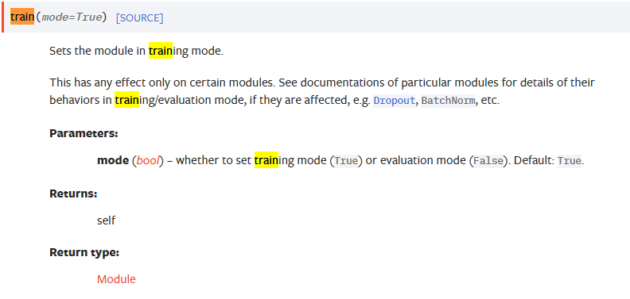

可以从官方文档中看到，train()/eval()都只对如Dropout，Batch等特定层起作用，若模型用不到这些层则可以不用

### 4.6.8 完整模型训练套路

#### 1 集显训练

```py
import torch.utils.data
import torchvision.datasets
from torch import nn
from torch.utils.tensorboard import SummaryWriter

#准备数据集
train_dataset = torchvision.datasets.CIFAR10('./dataset', train=True,
                                         transform=torchvision.transforms.ToTensor(), download=True)
test_dataset = torchvision.datasets.CIFAR10('./dataset', train=False,
                                         transform=torchvision.transforms.ToTensor(), download=True)

#输出长度
train_dataset_len = len(train_dataset)
test_dataset_len = len(test_dataset)
print('len(train_dataset):{}'.format(train_dataset_len))
print('len(test_dataset):{}'.format(test_dataset_len))

#dataloader
train_dataloader = torch.utils.data.DataLoader(train_dataset, 64)
test_dataloader = torch.utils.data.DataLoader(test_dataset, 64)

#tensorboard
writer = SummaryWriter('./logs_train_loss')

#搭建CIFAR10的网络
class Tudui(nn.Module):
    def __init__(self):
        super().__init__()
        self.model = nn.Sequential(
            nn.Conv2d(3, 32, 5, 1, 2),
            nn.MaxPool2d(2),
            nn.Conv2d(32, 32, 5, 1, 2),
            nn.MaxPool2d(2),
            nn.Conv2d(32, 64, 5, 1, 2),
            nn.MaxPool2d(2),
            nn.Flatten(),
            nn.Linear(64*4*4, 64),
            nn.Linear(64, 10)
        )
    def forward(self, x):
        x = self.model(x)
        return x

tudui = Tudui()

#损失函数
loss_func = nn.CrossEntropyLoss()

#优化器
learning_rate = 0.01
optimizer = torch.optim.SGD(tudui.parameters(), lr=learning_rate)

#设置训练参数
epoch = 10
#实时训练次数
train_step = 0
#实时测试次数
test_step = 0


for i in range(epoch):
    print("---------epoch {} start---------".format(i+1))
    #训练
    tudui.train()
    for data in train_dataloader:
        imgs, targets = data
        outputs = tudui(imgs)
        #计算损失
        loss = loss_func(outputs, targets)

        #优化模型
        optimizer.zero_grad() #梯度清零
        loss.backward() #反向传播得出梯度
        optimizer.step() #更新梯度

        #累计次数,训练不需要累计loss
        train_step += 1

        if train_step % 100 == 0:
            print("train times:{}, loss:{}".format(train_step, loss.item()))
            # tensorboard
            writer.add_scalar('train_loss', loss.item(), train_step)

    #测试
    tudui.eval()
    test_total_loss = 0
    total_accuracy = 0
    #使用with torch.no_grad,表明当前计算不需要反向传播，使用之后，强制后边的内容不进行计算图的构建；还能节约性能
    with torch.no_grad():
        for data in test_dataloader:
            imgs, targets = data
            outputs = tudui(imgs)
            loss = loss_func(outputs, targets)

            test_total_loss += loss.item()
            accuracy = (outputs.argmax(1)==targets).sum()
            total_accuracy += accuracy

    #每次epoch后统计
    print("epoch {} test_loss:{}".format((i+1), test_total_loss))
    print("epoch {} test_acc:{}".format((i+1), total_accuracy/test_dataset_len))
    # tensorboard
    test_step += 1
    writer.add_scalar('test_total_loss', test_total_loss, test_step)
    writer.add_scalar('test_acc', total_accuracy/test_dataset_len, test_step)

    #每次epoch后保存模型,这里采用方式一
    torch.save(tudui, 'tudui_epoch{}'.format(i+1))
```

#### 2 GPU训练

使用gpu训练时，在代码中找到以下3处，加入.cuda()即可

1. ***网络模型***
2. ***训练和测试的数据（输入，标注）***
3. ***损失函数***

```py
#方式一
if torch.cuda.is_avaliable():
    model = model.cuda()
----------------------------------------
if torch.cuda.is_avaliable():
    imgs = imgs.cuda()
    targets = targets.cuda()
----------------------------------------
if torch.cuda.is_avaliable():
    loss_fn = loss.cuda()
```

```py
#方式二
#定义训练的设备
device = torch.device("cpu")
device = torch.device("cuda")
device = torch.device("cuda:0")#和上面一条同理
#推荐写法
device = torch.device("cuda" if torch.cuda.is_avaliable() else 'cpu')

#随后在代码模型，数据，损失函数3处中添加设备
model = model.to(device)
loss_fn = loss_fn.to(device)
imgs = imgs.to(device)
targets = targets.to(device)
```

### 4.6.9 完整模型验证套路

```py
#这里随便训练完后从网上找一张狗的图片进行验证
import torch
from PIL import Image
from torch import nn
from torchvision import transforms

img_path = './test_data/dog.png'

image = Image.open(img_path)
image = image.convert('RGB')

trans_tool = transforms.Compose([
    transforms.ToTensor(),
    transforms.Resize((32, 32))
])

print(image.size)
image = trans_tool(image)
image = torch.reshape(image, (1, 3, 32, 32))
print(image.shape) #torch.Size([3, 32, 32])


class Tudui(nn.Module):
    def __init__(self):
        super().__init__()
        self.model = nn.Sequential(
            nn.Conv2d(3, 32, 5, 1, 2),
            nn.MaxPool2d(2),
            nn.Conv2d(32, 32, 5, 1, 2),
            nn.MaxPool2d(2),
            nn.Conv2d(32, 64, 5, 1, 2),
            nn.MaxPool2d(2),
            nn.Flatten(),
            nn.Linear(64*4*4, 64),
            nn.Linear(64, 10)
        )
    def forward(self, x):
        x = self.model(x)
        return x
#具体来说，map_location参数是用于重定向，比如此前模型的参数是在cpu中的，我们希望将其加载到cuda:0中。
model = torch.load('./tudui_epoch10', map_location='cuda')

model.eval()
with torch.no_grad():
    output = model(image)

print(output.argmax(1))
```


## 4.7 opencv

```py
#windows使用pip安装
pip install opencv-python -i https://pypi.tuna.tsinghua.edu.cn/simple
```

## 4.8 [tqdm](https://blog.csdn.net/All_In_gzx_cc/article/details/126664224?ops_request_misc=%257B%2522request%255Fid%2522%253A%2522169698826916800215024475%2522%252C%2522scm%2522%253A%252220140713.130102334..%2522%257D&request_id=169698826916800215024475&biz_id=0&utm_medium=distribute.pc_search_result.none-task-blog-2~all~top_click~default-2-126664224-null-null.142^v95^insert_down28v1&utm_term=tqdm%E5%BA%93&spm=1018.2226.3001.4187)

```py
import time
from tqdm import *

for i in tqdm(range(1000)):
	time.sleep(.01) #进度条每0.01s前进一次，总时间为1000*0.01=10s 

# 运行结果如下
100%|██████████| 1000/1000 [00:10<00:00, 93.21it/s]  
------------------------------------------------------------
from tqdm import trange
#trange(i)是 tqdm(range(i))的简单写法
for i in trange(1000):
	time.sleep(.01)

# 运行结果如下
100%|██████████| 1000/1000 [00:10<00:00, 93.21it/s]  
```


# 5 问题

## 5.1 python问题

### 5.1.1 [python路径为啥要用“//”?](https://www.cnblogs.com/zwt20120701/p/11267457.html)

### 5.1.2 [r'字符串'是什么意思]([Python中的r字符串前缀及其用法详解_python 字符串前带r_念广隶的博客-CSDN博客](https://blog.csdn.net/lsoxvxe/article/details/132001495?ops_request_misc=%7B%22request%5Fid%22%3A%22169405062216777224494582%22%2C%22scm%22%3A%2220140713.130102334..%22%7D&request_id=169405062216777224494582&biz_id=0&utm_medium=distribute.pc_search_result.none-task-blog-2~all~sobaiduend~default-2-132001495-null-null.142^v93^insert_down28v1&utm_term=python r字符串&spm=1018.2226.3001.4187))

### 5.1.3 Python为什么要用Numpy？

Python中提供了list容器，可以当作数组使用。但列表中的元素可以是任何对象，因此列表中保存的是对象的指针，这样一来，为了保存一个简单的列表[1,2,3]。就需要三个指针和三个整数对象。对于数值运算来说，这种结构显然不够高效。
Python虽然也提供了array模块，但其只支持一维数组，不支持多维数组，也没有各种运算函数。因而不适合数值运算。
Numpy内置丰富的方法，能更加轻松高效地进行科学计算。

### 5.1.4 使用各类方法的注意

关于使用各类函数时的注意点：若声明处有默认值，一般不动，填参数时只需填没有默认值的值就可以了

不知道新函数的返回值时，以下几种思路：

> print
>
> print(type(...))
>
> debug
>
> 上网查

### 5.1.5 定义类时可以直接使用self.xx代替变量的声明


# 6 ai基础

## 6.1 深度学习

### 6.1.1 [图像基础](https://blog.csdn.net/weixin_44211968/article/details/123876506?ops_request_misc=%257B%2522request%255Fid%2522%253A%2522169459167716800222837715%2522%252C%2522scm%2522%253A%252220140713.130102334..%2522%257D&request_id=169459167716800222837715&biz_id=0&utm_medium=distribute.pc_search_result.none-task-blog-2~all~top_click~default-1-123876506-null-null.142^v93^insert_down28v1&utm_term=%E5%9B%BE%E5%83%8F%E9%80%9A%E9%81%93&spm=1018.2226.3001.4187)

图片可以看作是 **三层** **二维数组** 的**叠加**，每一层二维数组都是一个通道。单通道的图像是灰色的，每个像素pixel只有一个value，数字越高，颜色越白，也就越亮。即三通道，每个通道由二维数组存储。

三层的 value 分别代表着这个点在三个通道的数值，计算机根据这些数值来确定这一个像素点的颜色。这就常见的三层 RGB 色彩空间的工作方式。

RGB 格式里(0,0,0)代表着黑色，(255,255,255)代表着白色。

注意: OpenCV(开源计算机视觉库，包含了许多可用的视觉算法，图像处理必备神器)图像通道的**默认排序是 BGR**。

#### 6.1.1.1 [HWC和CHW](https://blog.csdn.net/hh1357102/article/details/130622666?ops_request_misc=%257B%2522request%255Fid%2522%253A%2522169459146616800227429193%2522%252C%2522scm%2522%253A%252220140713.130102334..%2522%257D&request_id=169459146616800227429193&biz_id=0&utm_medium=distribute.pc_search_result.none-task-blog-2~all~sobaiduend~default-1-130622666-null-null.142^v93^insert_down28v1&utm_term=RGB%E5%9B%BE%E5%83%8F%E7%9A%84%E5%AD%98%E5%82%A8&spm=1018.2226.3001.4187)

##### 1 HWC

**HWC可以看作是一幅图像的shape**，H表示图像的高度(height)，W表示图像的宽度(Width)，而C表示一幅图像的通道数(Channel)。HWC格式是指按照高度、宽度和通道数的顺序排列图像尺寸的格式。例如，一张形状为256×256×3的RGB图像，在HWC格式中表示为[256, 256, 3]。在一些图像处理库或者底层框架中，例如**OpenCV和TensorFlow，通常使用HWC格式表示图像尺寸。**

在OpenCV中，读取的图片默认是HWC格式

**举个小栗子**

hwc=[5,5,3] 的含义是什么呢？

大家可以思考一下，以图像为例，那么高宽都是5，3就是其中的通道数。因此我们也可以理解为***\*3个 5\*5 大小的特征图\****。 


##### 2 CHW

CHW格式是指按照通道数、高度和宽度的顺序排列图像尺寸的格式。例如，一张形状为3×256×256的RGB图像，在CHW格式中表示为[3, 256, 256]。**在计算机视觉和深度学习中如pytorch，通常使用CHW格式表示图像尺寸。**

例如，一个2x2的RGB图像在CHW格式下可能会以以下方式转为一维数组：

```py
原始的CHW格式表示为：
[
    [[R11, R12], [R21, R22]],
    [[G11, G12], [G21, G22]],
    [[B11, B12], [B21, B22]]
]
行优先扁平化后的一维表示为：
[R11, R12, R21, R22, G11, G12, G21, G22, B11, B12, B21, B22]
```

**为什么pytorch中transforms.ToTorch要把(H,W,C)的矩阵转为(C,H,W)?** 

- 因为pytorch很多函数都是设计成假设你的输入是 （c，h，w）的格式，当然你如果不嫌麻烦的话可以每次要用这些函数的时候转成chw格式，但我想这会比你输入的时候就转成chw要麻烦很多。
- 至于为什么pytorch选择设计成chw而不是hwc（毕竟传统的读图片的函数opencv的cv2.imread或者sklearn的imread都是读成hwc的格式的）这点确实比较令初学者困惑。个人感觉是因为pytorch做矩阵加减乘除以及卷积等运算是需要调用cuda和cudnn的函数的，而这些接口都设成成chw格式了，故而pytorch为了方便起见也设计成chw格式了。
- 那新问题就来了，cuda和cudnn为什么设计成chw格式呢？我想这是由于涉及到图片操作的都是和卷积相关的，而内部做卷积运算的加速设计成chw在操作上会比hwc处理起来更容易，更快。


##### 3 Torch将HWC格式转为CHW

```py
from PIL import Image
from torchvision.transforms import ToTensor
 
img = Image.open('image_path')
#产生的PIL_image格式数据的取值范围是[0,255]
#形状(shape)是[h, w, c]
#像素顺序是RGB
 
tensor = ToTensor()(PIL_img)
 	
# 或者
np_data = np.asarray(PIL_img)
tensor = ToTensor()(np_data)
```


### 6.1.2 数学基础

#### 6.1.2.1 [归一化（normalization）](https://blog.csdn.net/yangbindxj/article/details/125294045?ops_request_misc=%257B%2522request%255Fid%2522%253A%2522169448177316800215060118%2522%252C%2522scm%2522%253A%252220140713.130102334..%2522%257D&request_id=169448177316800215060118&biz_id=0&utm_medium=distribute.pc_search_result.none-task-blog-2~all~top_positive~default-2-125294045-null-null.142^v93^insert_down28v1&utm_term=%E5%BD%92%E4%B8%80%E5%8C%96&spm=1018.2226.3001.4187&ydreferer=aHR0cHM6Ly9zby5jc2RuLm5ldC9zby9zZWFyY2g%2Fc3BtPTEwMDEuMjEwMS4zMDAxLjQ0OTgmcT0lRTUlQkQlOTIlRTQlQjglODAlRTUlOEMlOTYmdD0mdT0%3D)

**归一化就是要把图片3个通道中的数据整理到[-1, 1]区间**

为了消除指标之间的量纲影响，需要进行[数据标准化处理](https://so.csdn.net/so/search?q=数据标准化处理&spm=1001.2101.3001.7020)，以解决数据指标之间的可比性。原始数据经过数据标准化处理后，各指标处于同一数量级，适合进行综合对比评价。其中，最典型的就是数据的归一化处理。

**简而言之，归一化的目的就是使得预处理的数据被限定在一定的范围内（比如[0,1]或者[-1,1]），从而消除奇异样本数据导致的不良影响。**

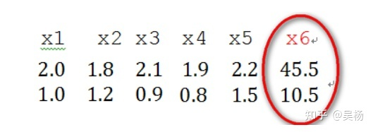

> **奇异样本数据的存在会引起训练时间增大，同时也可能导致无法收敛，因此，当存在奇异样本数据时，在进行训练之前需要对预处理数据进行归一化；反之，不存在奇异样本数据时，则可以不进行归一化。**

**归一化的对比**

> 如果不进行归一化，那么由于特征向量中不同特征的取值相差较大，会导致目标函数变“扁”。这样在进行梯度下降的时候，梯度的方向就会偏离最小值的方向，走很多弯路，即训练时间过长。

**归一化的例子**

归一化就是个得分转换成概率的过程

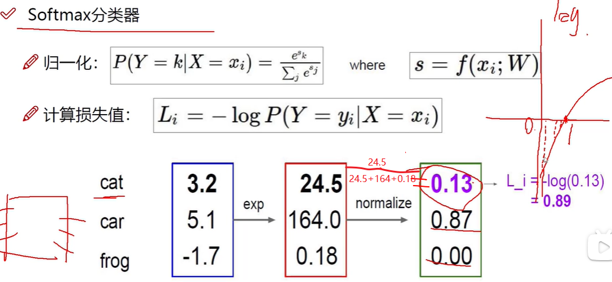


#### 6.1.2.3 标准化


#### 6.1.2.4 正则化(惩罚项)

正则化是用来防止模型过拟合而采取的手段。

第一项是模型数据损失，后面一项是当前这个模型的权重参数W所带来的损失。这里主要是通过调节lamda来调节损失

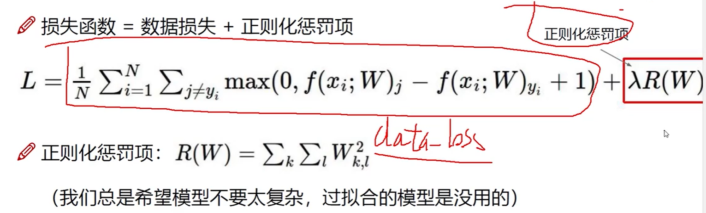

可以看到，lamda越大，惩罚力度越小，可以看到整个训练结果奇形怪状，这是网络中权重参数不稳定有的小有的大导致，因此将lamda调大会比较合适。

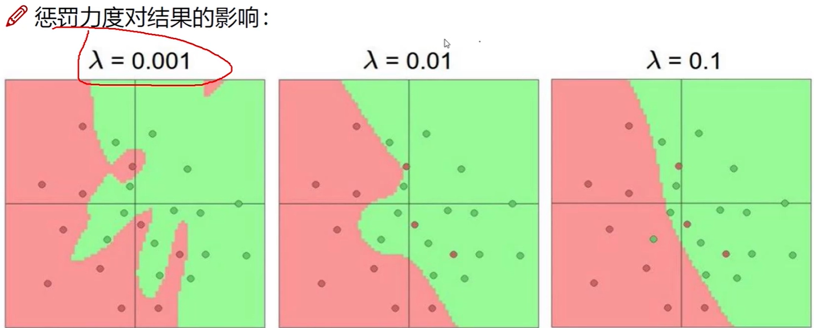


#### 6.1.2.5 得分函数

x经过网络WX+b就会得到得分输出，这里假设x是3072×1的向量，3072是像素点，要将x分为10类，则需要使用10×3072的矩阵相乘得到10×1的向量，如此一看看向量哪个值得分（值）大就说明哪个分类的得分高。

- 这里可以对应神经网络的最后一层或者是solfmax层来理解
- ***W权重矩阵起决定性作用，偏置b起微调作用***

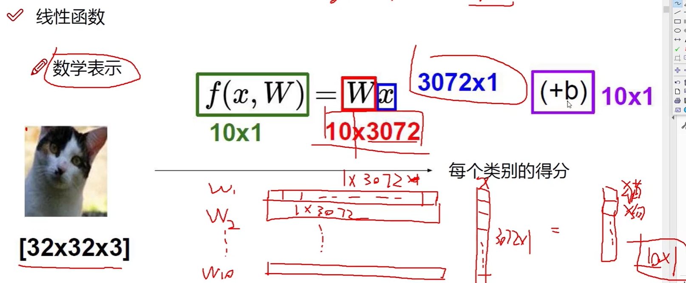


#### 6.1.2.6 [范数](https://blog.csdn.net/weixin_42066990/article/details/118636995?ops_request_misc=%257B%2522request%255Fid%2522%253A%2522169508767416800188597670%2522%252C%2522scm%2522%253A%252220140713.130102334..%2522%257D&request_id=169508767416800188597670&biz_id=0&utm_medium=distribute.pc_search_result.none-task-blog-2~all~sobaiduend~default-1-118636995-null-null.142^v94^insert_down28v1&utm_term=%E8%8C%83%E6%95%B0%E6%98%AF%E4%BB%80%E4%B9%88&spm=1018.2226.3001.4187)

它常常被用来度量某个向量空间（或矩阵）中的每个向量的长度或大小。


#### 6.1.2.7 [最小二乘法](https://blog.csdn.net/MoreAction_/article/details/106443383?ops_request_misc=%257B%2522request%255Fid%2522%253A%2522169581087116800197077799%2522%252C%2522scm%2522%253A%252220140713.130102334..%2522%257D&request_id=169581087116800197077799&biz_id=0&utm_medium=distribute.pc_search_result.none-task-blog-2~all~top_positive~default-1-106443383-null-null.142^v94^insert_down28v1&utm_term=%E6%9C%80%E5%B0%8F%E4%BA%8C%E4%B9%98%E6%B3%95&spm=1018.2226.3001.4187)

最小二乘法就是一种思想，它可以拟合任意函数，线性回归只是其中一个比较简单而且也很常用的函数，所以讲最小二乘法基本都会以它为例。

求法：

大概就是先求出损失函数表达式，然后对损失函数求(偏)导，最后求出使得损失最低的参数。


#### 6.1.2.8 [梯度](https://blog.csdn.net/walilk/article/details/50978864?ops_request_misc=%257B%2522request%255Fid%2522%253A%2522169586736916800197083413%2522%252C%2522scm%2522%253A%252220140713.130102334.pc%255Fall.%2522%257D&request_id=169586736916800197083413&biz_id=0&utm_medium=distribute.pc_search_result.none-task-blog-2~all~first_rank_ecpm_v1~hot_rank-9-50978864-null-null.142^v94^insert_down28v1&utm_term=%E6%A2%AF%E5%BA%A6&spm=1018.2226.3001.4187)

梯度定义如下：
　函数在某一点的梯度是这样一个向量，它的方向与取得最大方向导数的方向一致，而它的模为方向导数的最大值。
　这里注意三点：
　1）梯度是一个向量，即有方向有大小；
　2）梯度的方向是最大方向导数的方向；
　3）梯度的值是最大方向导数的值。

***引出梯度下降法：***

既然在变量空间的某一点处，函数沿梯度方向具有最大的变化率，那么在优化目标函数的时候，自然是沿着**负梯度方向**去减小函数值，以此达到我们的优化目标。

同时梯度和偏导数都是向量，那么参考向量运算法则，我们在每个变量轴上减小对应变量值即可，梯度下降法可以描述如下：
　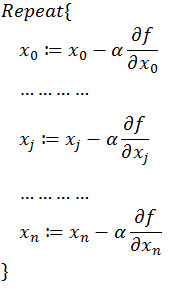

***梯度的链式法则：结合反向传播***

要计算q=x+y，f=q*z，要计算f对x偏导(梯度)，则要使用链式法则--->fx偏导=fq偏导*×qx偏导

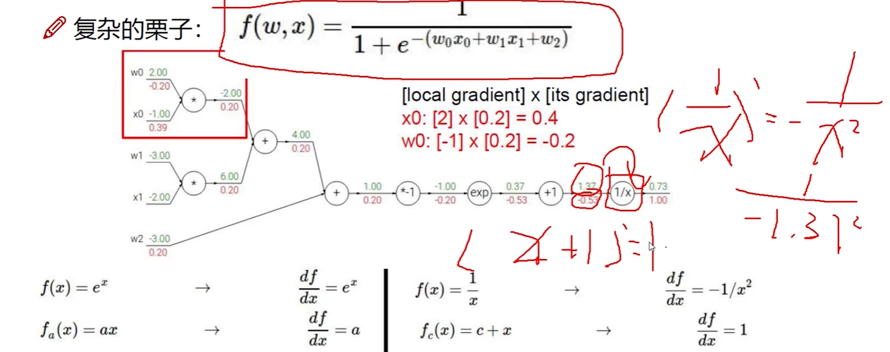


### 6.1.3 理论基础

#### 6.1.3.1 熵

##### 1 定义

那么熵的那些描述和解释(混乱程度，不确定性，惊奇程度，不可预测性，信息量等)代表了什么呢？

如果熵比较大(即平均编码长度较长)，意味着这一信息有较多的可能状态，相应的每个状态的可能性比较低；因此每当来了一个新的信息，我们很难对其作出准确预测，即有着比较大的混乱程度/不确定性/不可预测性。

并且当一个罕见的信息到达时，比一个常见的信息有着更多的信息量，因为它排除了别的很多的可能性，告诉了我们一个确切的信息。在天气的例子中，Rainy发生的概率为12.5%，当接收到该信息时，我们减少了87.5%的不确定性(Fine,Cloudy,Snow)；如果接收到Fine(50%)的消息，我们只减少了50%的不确定性。

##### 2 [交叉熵（分类常见的损失函数）](https://blog.csdn.net/Yue_Zengying/article/details/117111510?ops_request_misc=&request_id=&biz_id=102&utm_term=%E4%BA%A4%E5%8F%89%E7%86%B5&utm_medium=distribute.pc_search_result.none-task-blog-2~all~sobaiduweb~default-9-117111510.142^v94^insert_down28v1&spm=1018.2226.3001.4187)

假设有两个机器学习模型对第一张照片分别作出了预测：Q1和Q2,而第一张照片的真实标签为[1,0,0,0,0]。

两个模型预测效果如何呢，可以分别计算下交叉熵：


交叉熵对比了模型的预测结果和数据的真实标签，随着预测越来越准确，交叉熵的值越来越小，如果预测完全正确，交叉熵的值就为0。因此，训练分类模型时，可以使用交叉熵作为损失函数。

##### 3 二分类交叉熵

在二分类模型中，标签只有是和否两种；这时，可以使用二分类交叉熵作为损失函数。假设数据集中只有猫和狗的照片，则交叉熵公式中只包含两种可能性：

而P(cat) = 1 - P(dog)
所以交叉熵可以表示为：
H(P,Q)=-P(cat)logQ(cat)-(1-P(cat))log(1-Q(cat))
使用如下定义：


二分类的交叉熵可以写作如下形式，看起来就熟悉多了。


#### 6.1.3.2 [泛化](https://blog.csdn.net/sc2079/article/details/103090727?ops_request_misc=%257B%2522request%255Fid%2522%253A%2522169580296016800185845355%2522%252C%2522scm%2522%253A%252220140713.130102334..%2522%257D&request_id=169580296016800185845355&biz_id=0&utm_medium=distribute.pc_search_result.none-task-blog-2~all~top_positive~default-1-103090727-null-null.142^v94^insert_down28v1&utm_term=%E6%B3%9B%E5%8C%96&spm=1018.2226.3001.4187)

机器学习（深度学习）的根本问题是优化和泛化之间的对立。

- 优化（optimization）是指调节模型以在训练数据上得到最佳性能（即机器学习中的学习），而泛化（generalization）是指训练好的模型在前所未见的数据上的性能好坏。

- 机器学习的目的当然是得到良好的泛化，但你无法控制泛化，只能基于训练数据调节模型。


#### 6.1.3.3 [过拟合](https://blog.csdn.net/sinat_38079265/article/details/121687241?ops_request_misc=%257B%2522request%255Fid%2522%253A%2522169579860516800180613574%2522%252C%2522scm%2522%253A%252220140713.130102334..%2522%257D&request_id=169579860516800180613574&biz_id=0&utm_medium=distribute.pc_search_result.none-task-blog-2~all~top_click~default-2-121687241-null-null.142^v94^insert_down28v1&utm_term=%E8%BF%87%E6%8B%9F%E5%90%88&spm=1018.2226.3001.4187)

##### 1 定义

过拟合：模型在训练集上表现的非常好，但在测试集的数据下表现很差。

> 具体观察loss函数就是，train loss一直降低，而test loss先降低，而后随着epoach的增加，而不断增加。

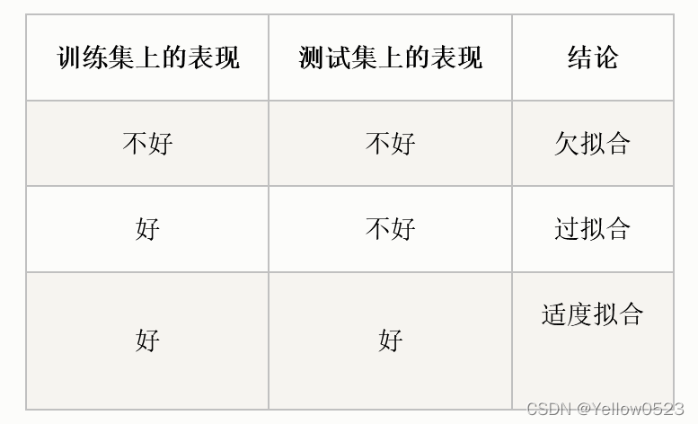

- 欠拟合：模型不能在训练集上获得足够低的误差；
- 拟合：测试误差与训练误差差距较小；
- 过拟合：训练误差和测试误差之间的差距太大；增强泛化能力就是防止过拟合的意思
- 不收敛：模型不是根据训练集训练得到的。

##### 2 过拟合的原因

1.训练数据太少（比如只有几百组）

2.模型的复杂度太高（比如隐藏层层数设置的过多，[神经元](https://so.csdn.net/so/search?q=神经元&spm=1001.2101.3001.7020)的数量设置的过大），举个简单的例子，你的模型是高射炮，结果你的数据是蚊子，这不就很扯淡了吗。

3.特征太多

4.只关心局部特征


##### 3 解决方案

- 1.降低模型的复杂度
  这也是最重要的一步，为了降低模型的复杂度，我们可以减少神经元的个数，减少隐藏层的层数（网络深度），尝试将复杂的网络结构一步步更换为较简单的网络结构。或者尝试使用传统的机器学习模型（比如随机森林，高斯过程回归，梯度提升回归树之类的模型）。

- 2.训练集增加更多的数据
  深度学习适应的场景往往就是大数据集，对于小样本，过拟合现象的产生往往是不可避免的。通过增加数据只能缓解过拟合，并不能避免。

- 3.数据增强

  使用数据增强可以生成多幅相似图像。这可以帮助我们增加数据集规模从而减少过拟合。因为随着数据量的增加，模型无法过拟合所有样本，因此不得不进行泛化。

  计算机视觉领域通常的做法有：翻转、平移、旋转、缩放、改变亮度、添加噪声等等

- 4.数据增强

- 5.增加惩罚因子（正则化），保留所有的特征，但是减少参数的大小（magnitude）。

#### 6.1.3.4 [感受野](https://blog.csdn.net/qq_43665602/article/details/126754736?ops_request_misc=%257B%2522request%255Fid%2522%253A%2522169664348116800211581763%2522%252C%2522scm%2522%253A%252220140713.130102334..%2522%257D&request_id=169664348116800211581763&biz_id=0&utm_medium=distribute.pc_search_result.none-task-blog-2~all~top_positive~default-1-126754736-null-null.142^v94^insert_down28v1&utm_term=%E6%84%9F%E5%8F%97%E9%87%8E&spm=1018.2226.3001.4187)

网络越深，卷积越多，感受野就越大

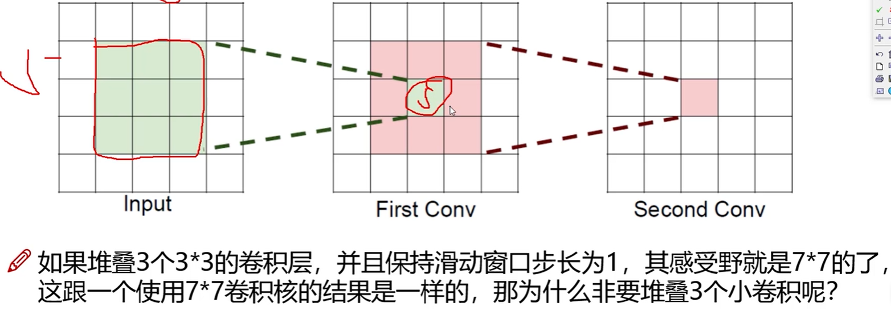

#### 6.1.3.5 [nlp词向量模型Word2Vec](https://blog.csdn.net/weixin_51545953/article/details/128622118?ops_request_misc=&request_id=&biz_id=102&utm_term=%E8%AF%8D%E5%90%91%E9%87%8F%E6%A8%A1%E5%9E%8B&utm_medium=distribute.pc_search_result.none-task-blog-2~all~sobaiduweb~default-0-128622118.nonecase&spm=1018.2226.3001.4187)

##### 1 定义

下图展示了一个50维的词向量：（可以是随便一个单词happy、car、person...）

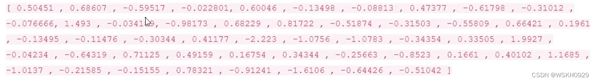

在热度图结果中比较可以发现，相似的词在特征表达中比较相似，也就是说明词的特征是有实际意义的！


文字怎么输入到神经网络中啊 ？这个问题很好，我们通常会用一个 Embedding 层来解决这个问题。如下图所示，在神经网络初始化的时候，我们会随机初始化一个 N×K 的矩阵，其中 N 是 词典的大小，K 是词向量的维数（一个自行设定的超参数）。然后，我们会用一个 N×N 的矩阵和 N×K 的矩阵相乘，得到一个新的 N×K的矩阵向下进行前向传播。其中，N×N 的矩阵会在输入的文字的对应对角线上设置为1，其余位置均为0。N×K 的矩阵是随机初始化的，通过反向传播进行更新调整。
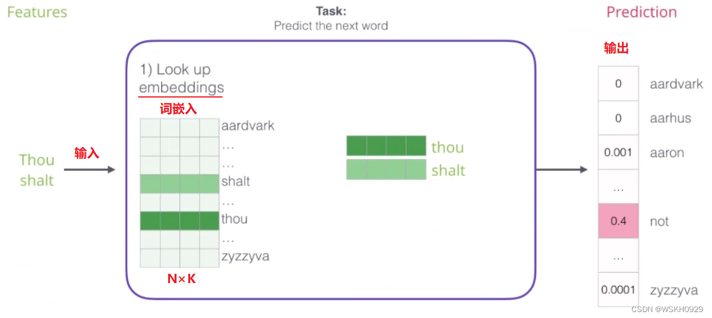

##### 2 训练数据构建

一切具有正常逻辑的语句都可以作为训练数据。如小说、论文等。如果我们有一个句子，那么我们可以按照下面你的方式构建数据集，选出前三个词，用前两个作为词模型的输入，最后一个词作为词模型输出的目标，继而进行训练。如下图所示：

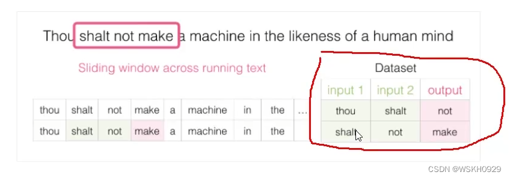

##### 3 CBOW/ Skip-gram模型


##### 4 负采样模型


#### 6.1.3.6 [下采样](https://blog.csdn.net/tingzhiyi/article/details/114368433?ops_request_misc=%257B%2522request%255Fid%2522%253A%2522169682232316800222888876%2522%252C%2522scm%2522%253A%252220140713.130102334..%2522%257D&request_id=169682232316800222888876&biz_id=0&utm_medium=distribute.pc_search_result.none-task-blog-2~all~top_positive~default-1-114368433-null-null.142^v95^insert_down28v1&utm_term=%E4%B8%8B%E9%87%87%E6%A0%B7&spm=1018.2226.3001.4187)

下采样（subsampled）：又名降采样、缩小图像；

主要目的有两个：1、使得图像符合显示区域的大小；2、生成对应图像的缩略图；

下采样的方式主要有两种：

- 1 采用stride为2的池化层，如Max-pooling和Average-pooling，目前通常使用Max-pooling，因为他计算简单而且能够更好的保留纹理特征；
- 2 采用stride为2的卷积层，下采样的过程是一个信息损失的过程，而池化层是不可学习的，用stride为2的可学习卷积层来代替pooling可以得到更好的效果，当然同时也增加了一定的计算量。


#### 6.1.3.7 feature map

就是特征图，如果是RGB则称其有3个featrue map


## 6.2 神经网络架构

### 6.2.1 卷积Convolution

#### 6.2.1.1 定义

最开始的卷积核可能是人为设定的，但现在机器学习会根据自己的数据去反向调节卷积核，最终找到最合适的卷积核。

每一个卷积核会对应一张特征图。有几个卷积核，就会有几个特征图。

图是几维的，卷积核就是几维的。


#### 6.2.1.2 尺寸计算公式

这里若出现分数，向下取整就好

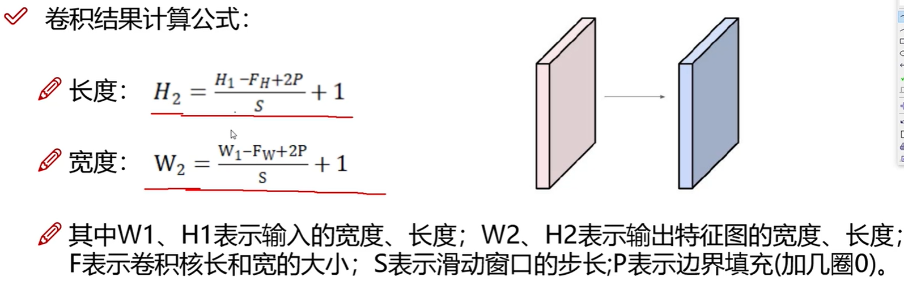


### 6.2.2 池化Pooling

精髓就是“压缩”

将图片中有特征的部分放大，没有特征的就不管了。具体做法就是将n×n的格子中最大的数添进新格子中

在模糊的同时尽量的保留了原始特征图的重要信息。

池化会把数据变小。


### 6.2.3 非线性激活

    如果[神经元](https://so.csdn.net/so/search?q=神经元&spm=1001.2101.3001.7020)的输出是输入的线性函数，而线性函数之间的嵌套任然会得到线性函数。如果不加非线性函数处理，那么最终得到的仍然是线性函数。所以需要在神经网络中引入非线性激活函数。在[人工神经网络](https://so.csdn.net/so/search?q=人工神经网络&spm=1001.2101.3001.7020)中，激活函数决定是否需要传递信号。

​	激活也会把数据变小。

​	常见的激活函数有：

- relu：非线性矫正函数，把小于0的x值全部去掉，用0来代替。
- tanh：双曲正切处理函数，把特征x的值压缩进-1到1的区间内，-1代表的是x中较小的数值，而1代表x中较大的数值。
- logistic：sigmod函数，将特征x的值压缩进0到1的区间内。

​	通过对比非线性操作前后的图像，发现经过非线性激活函数处理之后的图像中的主要内容更突出了。
    ReLU函数处理自然语言效果更佳，Sigmoid函数处理图像效果更佳。

图中relu是不计入层数的，所以一共有9层


### 6.2.4 Dropout层

dropout是使指定概率的权重随机失活，作用是加快训练速度，测试的时候是不用的


### 6.2.5 [全连接层](https://blog.csdn.net/qq_39521554/article/details/81385159?ops_request_misc=%257B%2522request%255Fid%2522%253A%2522169573564916800222887711%2522%252C%2522scm%2522%253A%252220140713.130102334.pc%255Fall.%2522%257D&request_id=169573564916800222887711&biz_id=0&utm_medium=distribute.pc_search_result.none-task-blog-2~all~first_rank_ecpm_v1~hot_rank-4-81385159-null-null.142^v94^insert_down28v1&utm_term=%E5%85%A8%E8%BF%9E%E6%8E%A5%E7%BD%91%E7%BB%9C&spm=1018.2226.3001.4187)

​	全连接层（fully connected layers，FC）在整个卷积神经网络中起到“分类器”的作用。如果说卷积层、池化层和激活函数层等操作是将原始数据映射到隐层特征空间的话，全连接层则起到将学到的“分布式特征表示”映射到样本标记空间的作用。在实际使用中，全连接层可由卷积操作实现：	

​	在CNN结构中，经多个卷积层和池化层后，连接着1个或1个以上的全连接层．与MLP类似，全连接层中的每个神经元与其前一层的所有神经元进行全连接．全连接层可以整合卷积层或者池化层中具有类别区分性的局部信息．为了提升 CNN网络性能，全连接层每个神经元的激励函数一般采用ReLU函数。


​	最后一层全连接层的输出值被传递给一个输出，可以采用softmax逻辑回归（softmax regression）进行分类，该层也可称为 softmax层（softmax layer）．对于一个具体的分类任务，选择一个合适的损失函数是十分重要的，CNN几种常用的损失函数并分析了它们各自的特点．通常，CNN的全连接层与MLP结构一样，CNN的训练算法也多采用BP算法。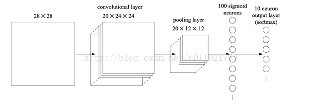

最后的两列小圆球就是两个全连接层，在最后一层卷积结束后，进行了最后一次池化，输出了20个12*12的图像，然后通过了一个全连接层变成了1*100的向量。

这是怎么做到的呢，其实就是有20*100个12*12的卷积核卷积出来的，对于输入的每一张图，用了一个和图像一样大小的核卷积，这样整幅图就变成了一个数了，如果厚度是20就是那20个核卷积完了之后相加求和。这样就能把一张图高度浓缩成一个数了。全连接的目的是什么呢？

因为传统的网络我们的输出都是分类，也就是几个类别的概率甚至就是一个数--类别号，那么**全连接层就是高度提纯的特征**了，方便交给最后的分类器或者回归。但是全连接的参数实在是太多了，你想这张图里就有20*12*12*100个参数，前面随便一层卷积，假设卷积核是7*7的，厚度是64，那也才7*7*64，所以现在的趋势是尽量避免全连接，目前主流的一个方法是全局平均值。

也就是***最后那一层的feature map（最后一层卷积的输出结果），直接求平均值。有多少种分类就训练多少层，这十个数字就是对应的概率或者叫置信度。***


### 6.2.6 [solfmax层](https://blog.csdn.net/yangwohenmai1/article/details/96156497?ops_request_misc=%257B%2522request%255Fid%2522%253A%2522169577759416800188578769%2522%252C%2522scm%2522%253A%252220140713.130102334..%2522%257D&request_id=169577759416800188578769&biz_id=0&utm_medium=distribute.pc_search_result.none-task-blog-2~all~top_positive~default-1-96156497-null-null.142^v94^insert_down28v1&utm_term=softmax%E5%B1%82&spm=1018.2226.3001.4187)

也叫solfmax分类器

***主要作用是将得分函数得出的得分值转化成每个类对应的概率***

Softmax回归模型是logistic回归模型在多分类问题上的推广，在多分类问题中，待分类的类别数量大于2，且类别之间互斥。比如我们的网络要完成的功能是识别0-9这10个手写数字，若最后一层的输出为[0,1,0, 0, 0, 0, 0, 0, 0, 0]，则表明我们网络的识别结果为数字1。

在我们的网络中，最后一层是softmax层，所以一般不会用到反向传播。

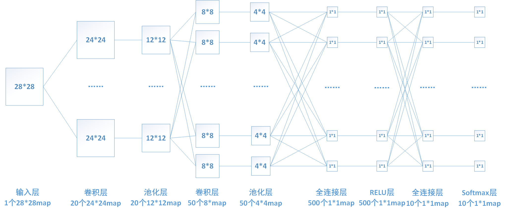

通过sigmod函数，将得分转化成概率值

引用一张网上的原理图，该图描述了*softmax*对输出结果的计算过程：其中[3,1,-3]是上一层的输出

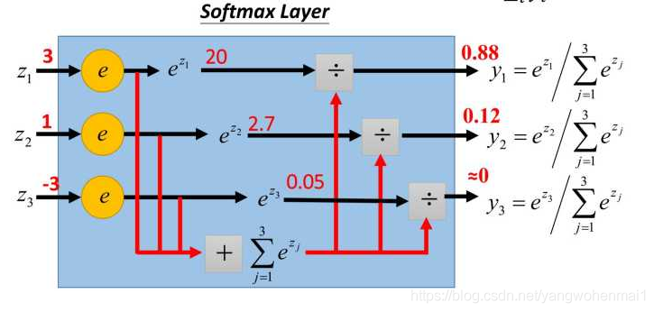

### 6.2.7 损失函数

损失函数一般习惯用归一化后的概率取-log()的形式来表现，由图可得，概率越靠近1的，取完-log后损失值就越小，反之越大

包括nn.CrossEntropyLoss的损失计算公式，整体也是这种计算思路。


### 6.2.8 梯度下降

梯度下降就是求一个函数的最小值。

梯度下降是机器学习中的[常用算法](https://so.csdn.net/so/search?q=常用算法&spm=1001.2101.3001.7020)，通过不断迭代计算函数的梯度，判断该点的某一方向和目标之间的距离，***最终求得最小的损失函数和相关参数***，为建立线性模型提供支持。

中心思想：就是通过不断迭代得到使得损失函数最小的权重。

对应代码就是torch的优化器optim（4.6.6）部分

#### 6.2.8.1 梯度下降的3种不同形式

##### 1 批量梯度下降

（Batch Gradient Descent） 

##### 2 随机梯度下降

（Stochastic Gradient Descent）

##### 3 小批量梯度下降(深度学习常用)

（Mini-Batch Gradient Descent）

#### 6.2.8.2 学习速率Lr

运用梯度下降算法进行优化时，权重的更新规则中，在梯度项前会乘以一个系数，这个系数就叫学习速率 α ：

- 如果学习速率太小，则会使收敛过慢。

- 如果学习速率太大，则会导致代价函数振荡，迭代过快，梯度下降法可能会越过最低点，甚至可能发散。
  


### 6.2.9 反向传播


### 6.2.10 边缘填充Padding

 目的是为了使得特征图边缘的特征能够被平等的利用。


## 6.3 [tensor中维度的理解](https://blog.csdn.net/AlexFaker/article/details/122526169?ops_request_misc=&request_id=&biz_id=102&utm_term=tensor%20%E7%BB%B4%E5%BA%A6&utm_medium=distribute.pc_search_result.none-task-blog-2~all~sobaiduweb~default-0-122526169.142^v94^insert_down28v1&spm=1018.2226.3001.4187)

```py
import torch

a = torch.randn(3, 4, 5)

print(a)

b = torch.cat((a,a), dim=0)
print(b)

c = torch.cat((a,a), dim=1)
print(c)

d = torch.cat((a,a), dim=2)
print(d)
```

```py
#输出 a
tensor([[[ 0.0696,  0.6560,  0.2202, -1.0453,  0.9021],
         [-0.1584, -0.9985, -1.1443, -1.4210, -0.4188],
         [ 1.4070,  2.9814, -2.1767,  1.0888,  0.9540],
         [ 0.3563, -0.7126,  0.2440, -0.1334, -1.0844]],

        [[ 0.2997,  0.8679, -0.8382,  0.8501, -1.4777],
         [-0.2198, -0.0803, -0.4598, -0.0678,  0.1530],
         [-0.4743, -0.5473, -1.2885, -1.7756, -0.4839],
         [ 0.8187, -0.0167,  1.6490,  0.4461, -1.6552]],

        [[ 1.3202, -0.8440,  0.1945,  0.3633,  0.2360],
         [ 1.0943,  2.1030, -0.5662, -0.8079, -1.3058],
         [ 0.6459, -0.2108, -0.8447, -0.7190,  0.3210],
         [-0.1285,  1.5799,  0.1454,  1.6499, -1.3747]]])
# b = torch.cat((a,a), dim=0)  -> 这里的0维对应的是a的第一个3，最高维拼接
tensor([[[ 0.0696,  0.6560,  0.2202, -1.0453,  0.9021],
         [-0.1584, -0.9985, -1.1443, -1.4210, -0.4188],
         [ 1.4070,  2.9814, -2.1767,  1.0888,  0.9540],
         [ 0.3563, -0.7126,  0.2440, -0.1334, -1.0844]],

        [[ 0.2997,  0.8679, -0.8382,  0.8501, -1.4777],
         [-0.2198, -0.0803, -0.4598, -0.0678,  0.1530],
         [-0.4743, -0.5473, -1.2885, -1.7756, -0.4839],
         [ 0.8187, -0.0167,  1.6490,  0.4461, -1.6552]],

        [[ 1.3202, -0.8440,  0.1945,  0.3633,  0.2360],
         [ 1.0943,  2.1030, -0.5662, -0.8079, -1.3058],
         [ 0.6459, -0.2108, -0.8447, -0.7190,  0.3210],
         [-0.1285,  1.5799,  0.1454,  1.6499, -1.3747]],

        [[ 0.0696,  0.6560,  0.2202, -1.0453,  0.9021],
         [-0.1584, -0.9985, -1.1443, -1.4210, -0.4188],
         [ 1.4070,  2.9814, -2.1767,  1.0888,  0.9540],
         [ 0.3563, -0.7126,  0.2440, -0.1334, -1.0844]],

        [[ 0.2997,  0.8679, -0.8382,  0.8501, -1.4777],
         [-0.2198, -0.0803, -0.4598, -0.0678,  0.1530],
         [-0.4743, -0.5473, -1.2885, -1.7756, -0.4839],
         [ 0.8187, -0.0167,  1.6490,  0.4461, -1.6552]],

        [[ 1.3202, -0.8440,  0.1945,  0.3633,  0.2360],
         [ 1.0943,  2.1030, -0.5662, -0.8079, -1.3058],
         [ 0.6459, -0.2108, -0.8447, -0.7190,  0.3210],
         [-0.1285,  1.5799,  0.1454,  1.6499, -1.3747]]])
#c = torch.cat((a,a), dim=1)  -> 1维对应第二维，列拼接
tensor([[[ 0.0696,  0.6560,  0.2202, -1.0453,  0.9021],
         [-0.1584, -0.9985, -1.1443, -1.4210, -0.4188],
         [ 1.4070,  2.9814, -2.1767,  1.0888,  0.9540],
         [ 0.3563, -0.7126,  0.2440, -0.1334, -1.0844],
         [ 0.0696,  0.6560,  0.2202, -1.0453,  0.9021],
         [-0.1584, -0.9985, -1.1443, -1.4210, -0.4188],
         [ 1.4070,  2.9814, -2.1767,  1.0888,  0.9540],
         [ 0.3563, -0.7126,  0.2440, -0.1334, -1.0844]],

        [[ 0.2997,  0.8679, -0.8382,  0.8501, -1.4777],
         [-0.2198, -0.0803, -0.4598, -0.0678,  0.1530],
         [-0.4743, -0.5473, -1.2885, -1.7756, -0.4839],
         [ 0.8187, -0.0167,  1.6490,  0.4461, -1.6552],
         [ 0.2997,  0.8679, -0.8382,  0.8501, -1.4777],
         [-0.2198, -0.0803, -0.4598, -0.0678,  0.1530],
         [-0.4743, -0.5473, -1.2885, -1.7756, -0.4839],
         [ 0.8187, -0.0167,  1.6490,  0.4461, -1.6552]],

        [[ 1.3202, -0.8440,  0.1945,  0.3633,  0.2360],
         [ 1.0943,  2.1030, -0.5662, -0.8079, -1.3058],
         [ 0.6459, -0.2108, -0.8447, -0.7190,  0.3210],
         [-0.1285,  1.5799,  0.1454,  1.6499, -1.3747],
         [ 1.3202, -0.8440,  0.1945,  0.3633,  0.2360],
         [ 1.0943,  2.1030, -0.5662, -0.8079, -1.3058],
         [ 0.6459, -0.2108, -0.8447, -0.7190,  0.3210],
         [-0.1285,  1.5799,  0.1454,  1.6499, -1.3747]]])
#d = torch.cat((a,a), dim=2)  -> dim=2对应最低维，对应行拼接
tensor([[[ 0.0696,  0.6560,  0.2202, -1.0453,  0.9021,  0.0696,  0.6560,
           0.2202, -1.0453,  0.9021],
         [-0.1584, -0.9985, -1.1443, -1.4210, -0.4188, -0.1584, -0.9985,
          -1.1443, -1.4210, -0.4188],
         [ 1.4070,  2.9814, -2.1767,  1.0888,  0.9540,  1.4070,  2.9814,
          -2.1767,  1.0888,  0.9540],
         [ 0.3563, -0.7126,  0.2440, -0.1334, -1.0844,  0.3563, -0.7126,
           0.2440, -0.1334, -1.0844]],

        [[ 0.2997,  0.8679, -0.8382,  0.8501, -1.4777,  0.2997,  0.8679,
          -0.8382,  0.8501, -1.4777],
         [-0.2198, -0.0803, -0.4598, -0.0678,  0.1530, -0.2198, -0.0803,
          -0.4598, -0.0678,  0.1530],
         [-0.4743, -0.5473, -1.2885, -1.7756, -0.4839, -0.4743, -0.5473,
          -1.2885, -1.7756, -0.4839],
         [ 0.8187, -0.0167,  1.6490,  0.4461, -1.6552,  0.8187, -0.0167,
           1.6490,  0.4461, -1.6552]],

        [[ 1.3202, -0.8440,  0.1945,  0.3633,  0.2360,  1.3202, -0.8440,
           0.1945,  0.3633,  0.2360],
         [ 1.0943,  2.1030, -0.5662, -0.8079, -1.3058,  1.0943,  2.1030,
          -0.5662, -0.8079, -1.3058],
         [ 0.6459, -0.2108, -0.8447, -0.7190,  0.3210,  0.6459, -0.2108,
          -0.8447, -0.7190,  0.3210],
         [-0.1285,  1.5799,  0.1454,  1.6499, -1.3747, -0.1285,  1.5799,
           0.1454,  1.6499, -1.3747]]])

Process finished with exit code 0

```


## 6.4 [迁移学习](https://blog.csdn.net/sikh_0529/article/details/126864397?ops_request_misc=&request_id=&biz_id=102&utm_term=%E8%BF%81%E7%A7%BB%E5%AD%A6%E4%B9%A0&utm_medium=distribute.pc_search_result.none-task-blog-2~all~sobaiduweb~default-1-126864397.142^v94^insert_down28v1&spm=1018.2226.3001.4187)

迁移学习(Transfer Learning)是一种机器学习方法，就是把为任务 A 开发的模型作为初始点，重新使用在为任务 B 开发模型的过程中。迁移学习是通过从已学习的相关任务中转移知识来改进学习的新任务，虽然大多数机器学习算法都是为了解决单个任务而设计的，但是促进迁移学习的算法的开发是机器学习社区持续关注的话题。 迁移学习对人类来说很常见，例如，我们可能会发现学习识别苹果可能有助于识别梨，或者学习弹奏电子琴可能有助于学习钢琴。

找到目标问题的相似性，迁移学习任务就是从相似性出发，将旧领域(domain)学习过的模型应用在新领域上。


- 

  


# 7 各种神经网络

## 7.0 神经网络

将下图的这种单个神经元


组织在一起，便形成了神经网络。下图便是一个三层神经网络结构


## 7.1 [卷积神经网络(cnn)](https://blog.csdn.net/v_JULY_v/article/details/51812459?ops_request_misc=%257B%2522request%255Fid%2522%253A%2522169572917716800197023772%2522%252C%2522scm%2522%253A%252220140713.130102334..%2522%257D&request_id=169572917716800197023772&biz_id=0&utm_medium=distribute.pc_search_result.none-task-blog-2~all~top_positive~default-1-51812459-null-null.142^v94^insert_down28v1&utm_term=cnn&spm=1018.2226.3001.4187)

### 7.1.1 cnn要解决的问题

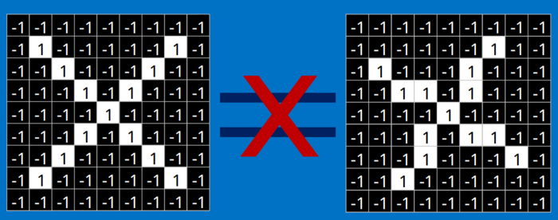

当比较两幅图的时候，如果有任何一个像素值不匹配，那么这两幅图就不匹配，至少对于计算机来说是这样的。对于这个例子，计算机认为上述两幅图中的白色像素除了中间的3*3的小方格里面是相同的，其他四个角上都不同：但是这么做，显得太不合理了。理想的情况下，我们希望，对于那些仅仅只是做了一些像平移，缩放，旋转，微变形等简单变换的图像，计算机仍然能够识别出图中的"X"和"O"。就像下面这些情况，我们希望计算机依然能够很快并且很准的识别出来：

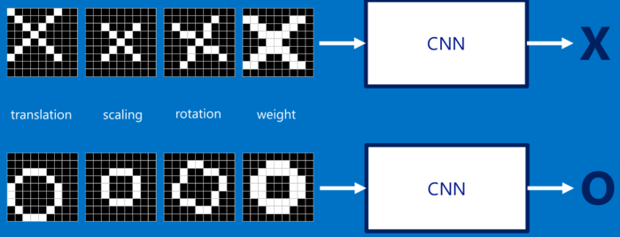

***对于CNN来说，它是一块一块地来进行比对。它拿来比对的这个“小块”我们称之为Features（特征/卷积核）。在两幅图中大致相同的位置找到一些粗糙的特征进行卷积运算，CNN能够更好的看到两幅图的相似性，相比起传统的整幅图逐一比对的方法。***

每一个feature就像是一个小图（就是一个比较小的有值的二维数组）。不同的Feature匹配图像中不同的特征。在字母"X"的例子中，那些由对角线和交叉线组成的features基本上能够识别出大多数"X"所具有的重要特征。
这些features很有可能就是匹配任何含有字母"X"的图中字母X的四个角和它的中心。如下：

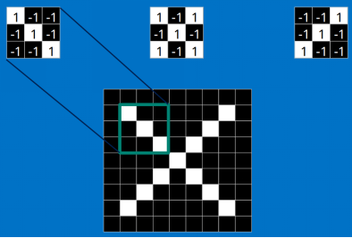


## 7.2 [RNN/LSTM](RNN/LSTM)

rnn是处理序列型数据

如：

1. 自然语言处理问题。x1可以看做是第一个单词，x2可以看做是第二个单词，依次类推。
2. 语音处理。此时，x1、x2、x3……是每帧的声音信号。
3. 时间序列问题。例如每天的股票价格等等。


循环使得RNN看起来非常神秘。然而，如果你仔细想想，这样也不比一个正常的神经网络难于理解。RNN可以被看做是同一神经网络的多次复制，每个神经网络模块会把消息传递给下一个。所以，如果我们将这个循环展开：

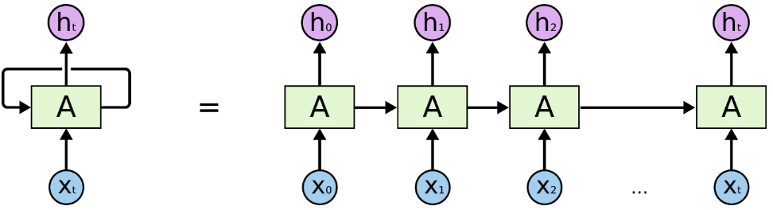

### 


## 7.3 [Resnet](https://blog.csdn.net/qq_42309130/article/details/117635432?ops_request_misc=%257B%2522request%255Fid%2522%253A%2522169681821416800197089073%2522%252C%2522scm%2522%253A%252220140713.130102334.pc%255Fall.%2522%257D&request_id=169681821416800197089073&biz_id=0&utm_medium=distribute.pc_search_result.none-task-blog-2~all~first_rank_ecpm_v1~rank_v31_ecpm-12-117635432-null-null.142^v95^insert_down28v1&utm_term=width_per_group&spm=1018.2226.3001.4187)

Resnet主要是为了防止传统神经网络层数过多而导致的梯度消失或者梯度爆炸而设计。

其主要原理就是在对数据进行变换后得到F(x)的同时最后还要加上原来的x，如果x需要优化就+F(x)变换，效果不好就F(x)=0不变

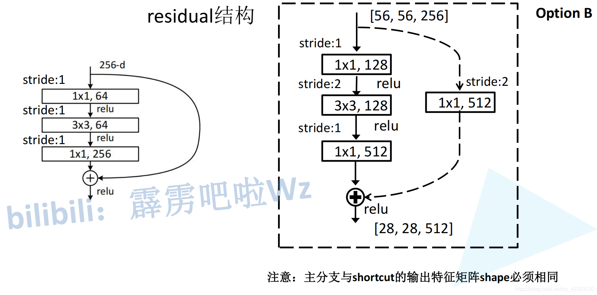

同时，还要注意维度的问题，因为如果在变换时stride≠1，则原来x的尺寸会缩小，这个时候直连也需要进行相应变化（如对X做1x1的卷积）；

求F(X)残差的卷积均使用3x3conv，下采样大小降维一半。

由于恒等映射X的存在，反向传播时，梯度可以从深层直接给到浅层，避免了梯度消失与爆炸。

### 7.3.0 各类Resnet的结构

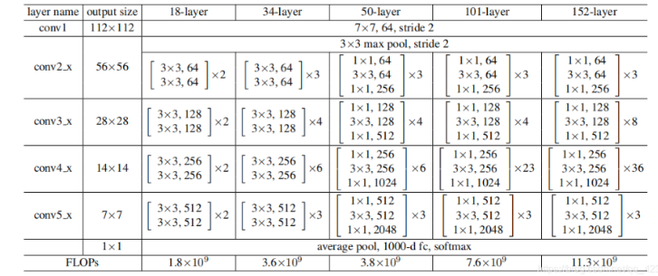


***我们可以了解到ResNet中对于50层以下(18/34)的构建块采用的是2层的BasicBlock，而大于50的深层**(50/101/152)**则采用的是3层的Bottleneck***

### 7.3.1 Resnet18/34

#### 7.3.1.1 ***Resnet18/34使用的残差块BasicBlock***

```py
class BasicBlock(nn.Module):
    expansion = 1
    #expansion是与三层残差块对应,三层残差块的最后一层深度会翻4倍

    def __init__(self, in_channel, out_channel, stride=1, downsample=None, **kwargs):
        """
        传入参数包括输入图像的深度,输出图像的深度,卷积步长默认是1,是否进行下采样
        """
        super(BasicBlock, self).__init__()
        self.conv1 = nn.Conv2d(in_channels=in_channel, out_channels=out_channel,
                               kernel_size=3, stride=stride, padding=1, bias=False)
        #两层型残差块的卷积核深度即为输入图像的深度,卷积核个数即为输出的深度,且均为3*3卷积核
        #第一层的卷积核步长当进行下采样时为2,故这里定为stride
        self.bn1 = nn.BatchNorm2d(out_channel)
        self.relu = nn.ReLU()
        self.conv2 = nn.Conv2d(in_channels=out_channel, out_channels=out_channel,
                               kernel_size=3, stride=1, padding=1, bias=False)
        self.bn2 = nn.BatchNorm2d(out_channel)
        self.downsample = downsample

    def forward(self, x):
        identity = x
        if self.downsample is not None:
            identity = self.downsample(x)

        out = self.conv1(x)
        out = self.bn1(out)
        out = self.relu(out)

        out = self.conv2(out)
        out = self.bn2(out)

        out += identity
        out = self.relu(out)

        return out
```


### 7.3.2 [Resnet50](https://blog.csdn.net/qq_42309130/article/details/117635432?ops_request_misc=%257B%2522request%255Fid%2522%253A%2522169681821416800197089073%2522%252C%2522scm%2522%253A%252220140713.130102334.pc%255Fall.%2522%257D&request_id=169681821416800197089073&biz_id=0&utm_medium=distribute.pc_search_result.none-task-blog-2~all~first_rank_ecpm_v1~rank_v31_ecpm-12-117635432-null-null.142^v95^insert_down28v1&utm_term=width_per_group&spm=1018.2226.3001.4187)

#### 7.3.2.1 ***Resnet50使用的残差块Bottleneck***

```py
class Bottleneck(nn.Module):
    """
    注意：原论文中，在虚线残差结构的主分支上，第一个1x1卷积层的步距是2，第二个3x3卷积层步距是1。
    但在pytorch官方实现过程中是第一个1x1卷积层的步距是1，第二个3x3卷积层步距是2，
    这么做的好处是能够在top1上提升大概0.5%的准确率。
    可参考Resnet v1.5 https://ngc.nvidia.com/catalog/model-scripts/nvidia:resnet_50_v1_5_for_pytorch
    """
    expansion = 4
    #取4是因为第三层的深度会翻4倍

    def __init__(self, in_channel, out_channel, stride=1, downsample=None,
                 groups=1, width_per_group=64):
        super(Bottleneck, self).__init__()
        #out_channel是指第1,2层的深度,width_per_group是指?,其余与2层残差块一致

        width = int(out_channel * (width_per_group / 64.)) * groups
        #width是指一通计算以后第1,2层的深度,这里与out_channel相等
        
        """
        算例:以conv_3实线结构为例
        """
        self.conv1 = nn.Conv2d(in_channels=in_channel, out_channels=width,
                               kernel_size=1, stride=1, bias=False)  # squeeze channels
        self.bn1 = nn.BatchNorm2d(width)
        # -----------------------------------------
        self.conv2 = nn.Conv2d(in_channels=width, out_channels=width, groups=groups,
                               kernel_size=3, stride=stride, bias=False, padding=1)
        #第二层的卷积核步长当进行下采样(虚线连接)时为2,故这里定为stride
        self.bn2 = nn.BatchNorm2d(width)
        # -----------------------------------------
        self.conv3 = nn.Conv2d(in_channels=width, out_channels=out_channel*self.expansion,
                               kernel_size=1, stride=1, bias=False)  # unsqueeze channels
        #第三层要注意深度翻4倍
        self.bn3 = nn.BatchNorm2d(out_channel*self.expansion)
        self.relu = nn.ReLU(inplace=True)
        self.downsample = downsample

    def forward(self, x):
        identity = x
        if self.downsample is not None:
            identity = self.downsample(x)

        out = self.conv1(x)
        out = self.bn1(out)
        out = self.relu(out)

        out = self.conv2(out)
        out = self.bn2(out)
        out = self.relu(out)

        out = self.conv3(out)
        out = self.bn3(out)

        out += identity
        out = self.relu(out)

        return out
```

### 7.3.3 Resnet搭建

#### 7.3.3.1 conv1搭建

```py
self.conv1 = nn.Conv2d(3, self.in_channel, kernel_size=7, stride=2,
                               padding=3, bias=False)
self.bn1 = nn.BatchNorm2d(self.in_channel)
self.relu = nn.ReLU(inplace=True)
self.maxpool = nn.MaxPool2d(kernel_size=3, stride=2, padding=1)
#其余略，详见博客
```

#### 7.3.3.2 conv2_x~conv5_x搭建

```py
#使用_make_layer()搭建：
#block：BasicBlock/Bottleneck
#channel：残差块中第一个卷积层的卷积核个数
#block_num：残差块个数 
#具体定义详见博客
def _make_layer(self, block, channel, block_num, stride=1):
-----------------------------------------------------------
#搭建
self.layer1 = self._make_layer(block, 64, blocks_num[0])
self.layer2 = self._make_layer(block, 128, blocks_num[1], stride=2)
self.layer3 = self._make_layer(block, 256, blocks_num[2], stride=2)
self.layer4 = self._make_layer(block, 512, blocks_num[3], stride=2)
```

#### 7.3.3.3 forward( )搭建

```py
def forward(self, x):
        x = self.conv1(x)
        x = self.bn1(x)

        x = self.relu(x)
        x = self.maxpool(x)

        x = self.layer1(x)
        x = self.layer2(x)
        x = self.layer3(x)
        x = self.layer4(x)

        if self.include_top:  # 一般为True
            x = self.avgpool(x)
            x = torch.flatten(x, 1)
            x = self.fc(x)

        return x
```

#### 7.3.3.4 定义不同类型的Resnet

```py
def resnet50(num_classes=1000, include_top=True):
    # https://download.pytorch.org/models/resnet50-19c8e357.pth
    return ResNet(Bottleneck, [3, 4, 6, 3], num_classes=num_classes, include_top=include_top)


def resnet34(num_classes=1000, include_top=True):
    # https://download.pytorch.org/models/resnet34-333f7ec4.pth
    return ResNet(BasicBlock, [3, 4, 6, 3], num_classes=num_classes, include_top=include_top)


def resnet101(num_classes=1000, include_top=True):
    # https://download.pytorch.org/models/resnet101-5d3b4d8f.pth
    return ResNet(Bottleneck, [3, 4, 23, 3], num_classes=num_classes, include_top=include_top)
```

### 7.3.4 训练


## 7.4 [MLP/ANN](MLP/ANN)

 多层感知机（MLP，Multilayer Perceptron）也叫[人工神经网络](https://so.csdn.net/so/search?q=人工神经网络&spm=1001.2101.3001.7020)（ANN，Artificial Neural Network），除了输入输出层，它中间可以有多个隐层，最简单的MLP只含一个隐层，即三层的结构，如下图：

1
